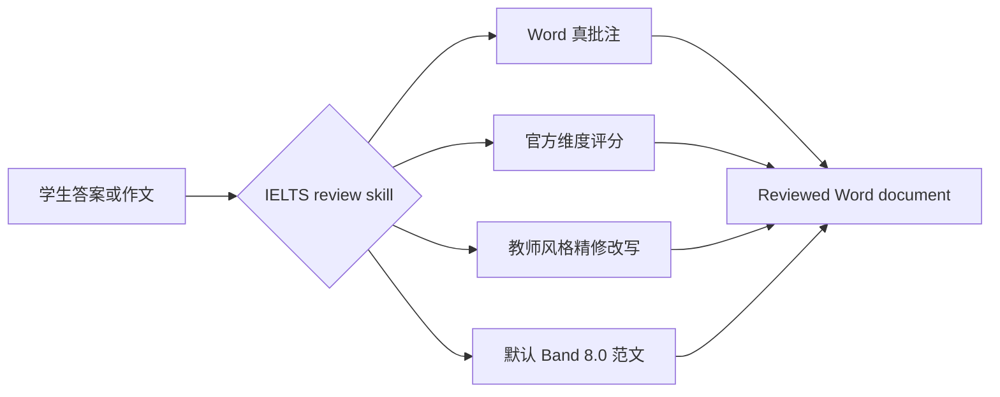

<div align="center">
  

  <h1>IELTS Writing Review Skills</h1>

  <p>
    Habilidades locales de corrección para IELTS Academic Writing Task 1 / Task 2, diseñadas para Codex y Claude Code.
    Soporta anotaciones reales en DOCX, criterios de calificación oficiales, comentarios en estilo docente, reescrituras precisas y generación de modelos de redacción.
  </p>

  <p>
    <a href="./README.md"><strong>简体中文</strong></a>
    · <a href="./docs/README.en.md">English</a>
    · <a href="./docs/README.ja.md">日本語</a>
    · <a href="./docs/README.ko.md">한국어</a>
    · <a href="./docs/README.es.md">Español</a>
  </p>

  <p>
    <a href="https://github.com/AaronL725/ielts-writing-review-skills/stargazers"></a>
    <a href="./LICENSE"></a>
    
    
    
  </p>
</div>

## ¿Qué es este repositorio?

Este repositorio empaqueta dos skills de corrección de redacción para IELTS, permitiendo que el agente AI no solo ofrezca consejos genéricos, sino que complete un flujo de corrección integral similar al de un profesor real: identificar el enunciado y el texto original del estudiante, insertar anotaciones reales de Word, proporcionar dimensiones de calificación oficiales, agregar reescrituras precisas por secciones y generar modelos de redacción de alta calidad correspondientes.

**Nivel objetivo por defecto: reescrituras en cursivo estables en Band 7.5, modelos de redacción finales estables en Band 8.0.** Si no especificas una banda objetivo adicional, ambas skills calibrarán por defecto las reescrituras en cursivo a un 7.5 estable y el modelo de respuesta/ensayo final a un 8.0 estable. También puedes escribir `Target band: 7.5`, `Target band: 8.0`, etc., en el prompt para que el agente ajuste el enfoque de la retroalimentación según tu objetivo.

| Skill | Escenarios recomendados | Salida por defecto |
| --- | --- | --- |
| `$ielts-task1-review` | Gráficos, tablas, mapas, diagramas de flujo y gráficos mixtos de Academic Task 1 | DOCX revisado con anotaciones de Word, puntuación, retroalimentación, reescrituras en cursivo estables de Band 7.5, ensayo modelo de 4 párrafos de Band 8.0 |
| `$ielts-task2-review` | Ensayos de Task 2 de opinión, discusión, resolución de problemas, ventajas/desventajas y tipos mixtos | DOCX revisado con anotaciones de Word, puntuación, retroalimentación, reescrituras en cursivo estables de Band 7.5, ensayo modelo de 4 párrafos de Band 8.0 |

## Requisitos de los archivos de entrada

Utiliza archivos `.docx` **sin corregir** como entrada. Los archivos revisados (reviewed) solo deben usarse como vista previa del resultado; no los uses para correcciones repetidas.

| Tipo | Cómo organizarlo en el documento Word | Lo que debes evitar |
| --- | --- | --- |
| Task 1 | El texto del enunciado al inicio; los gráficos/mapas/diagramas como imágenes incrustadas de Word después del enunciado; la respuesta del estudiante después de las imágenes, separada por párrafos normales. | No coloques la respuesta del estudiante antes de las imágenes; no omitas los gráficos; no incluyas puntuaciones, modelos o anotaciones antiguas en el archivo de entrada. |
| Task 2 | El enunciado completo al inicio; si hay un esquema (outline), colócalo después del enunciado y antes del ensayo formal; el ensayo formal al final, separado por párrafos normales. | No coloques el enunciado después del ensayo; no confundas el esquema con el ensayo formal; no incluyas retroalimentación antigua, modelos o contenido revisado en el archivo de entrada. |

Estas ubicaciones son cruciales, ya que la skill primero distingue entre el enunciado, las imágenes, el esquema y el texto principal del estudiante, para luego anclar los comentarios de Word a los párrafos del texto del estudiante.

## Archivos de ejemplo

El directorio `examples/` del repositorio contiene un conjunto de ejemplos para Task 1 y Task 2. Los archivos sin `(reviewed)` son ejemplos de entrada, y los archivos con `(reviewed)` son vistas previa del resultado tras la corrección.

| Ejemplo | Archivo |
| --- | --- |
| Entrada Task 1 | [C19T4 Writing Task 1.docx](<./examples/C19T4 Writing Task 1.docx>) |
| Salida revisada Task 1 | [C19T4 Writing Task 1(reviewed).docx](<./examples/C19T4 Writing Task 1(reviewed).docx>) |
| Entrada Task 2 | [C19T4 Writing Task 2.docx](<./examples/C19T4 Writing Task 2.docx>) |
| Salida revisada Task 2 | [C19T4 Writing Task 2(reviewed).docx](<./examples/C19T4 Writing Task 2(reviewed).docx>) |

## Características principales

| Experiencia de corrección real | Conocimiento integrado de IELTS | Amigable para agentes |
| --- | --- | --- |
| Inserta comentarios reales de Word, no anotaciones entre paréntesis en texto plano | Utiliza los descriptores de banda oficiales de IELTS para la calificación | Funciona como skill local para Codex y Claude Code |
| Los comentarios se anclan al texto original del estudiante, sin afectar al enunciado o esquema | Reglas en estilo docente y referencias de extracción de muestras integradas | Incluye scripts para extracción, generación y validación de DOCX |
| Inserta una reescritura concisa en cursivo después del texto original | En Task 1, prioriza el análisis visual; en Task 2, prioriza la respuesta a la tarea | Conserva el archivo original y genera una copia revisada independiente |
| Genera página de puntuación, retroalimentación breve y ensayo modelo | Reescrituras en cursivo predeterminadas a Band 7.5, ensayo modelo final a Band 8.0 | Permite personalizar la banda objetivo mediante el prompt |

## Flujo de corrección



## Instalación

### Prompt de instalación para agentes genéricos

```text
Install the IELTS Writing Review Skills from this GitHub repository: https://github.com/AaronL725/ielts-writing-review-skills and put the two skills into the correct local skills directory.
```

También puedes instalarlo manualmente:

Clona el repositorio primero:

```bash
git clone https://github.com/AaronL725/ielts-writing-review-skills.git
cd ielts-writing-review-skills
```

### Codex

Instala ambas skills en el directorio de skills de Codex:

```bash
mkdir -p "${CODEX_HOME:-$HOME/.codex}/skills"
cp -R skills/ielts-task1-review skills/ielts-task2-review "${CODEX_HOME:-$HOME/.codex}/skills/"
```

### Claude Code

Instálalas como skills personales de Claude Code:

```bash
mkdir -p "$HOME/.claude/skills"
cp -R skills/ielts-task1-review skills/ielts-task2-review "$HOME/.claude/skills/"
```

Si deseas usarlas solo en un proyecto específico, puedes copiarlas al directorio de nivel de proyecto `.claude/skills`:

```bash
mkdir -p .claude/skills
cp -R skills/ielts-task1-review skills/ielts-task2-review .claude/skills/
```

## Ejemplos de prompts

```text
Use $ielts-task1-review to review my IELTS Academic Writing Task 1 answer: [paste the path of your answer]
```

```text
Use $ielts-task2-review to review my IELTS Writing Task 2 essay: [paste the path of your essay]
```

```text
Use $ielts-task1-review to review my IELTS Academic Writing Task 1 answer. Target band: [your target band]. File: [paste the path of your answer]
```

```text
Use $ielts-task2-review to review my IELTS Writing Task 2 essay. Target band: [your target band]. File: [paste the path of your essay]
```

## ¿Qué incluye cada Skill?

La skill de Task 1 incluye un flujo de análisis visual, los criterios de calificación oficiales de Task 1, reglas de corrección en estilo docente, referencias de extracción de muestras, muestras de gráficos, scripts de extracción de DOCX, scripts de generación de DOCX y scripts de validación.

La skill de Task 2 incluye extracción de enunciado y ensayo, criterios de calificación oficiales de Task 2, reglas de corrección en estilo docente, referencias de extracción de muestras, lógica de coincidencia de muestras docentes, scripts de generación de DOCX y scripts de validación.

## Estructura del repositorio

```text
.
|-- assets/
|   `-- ielts-writing-review-skills-hero.png
|-- docs/
|   |-- README.en.md
|   |-- README.es.md
|   |-- README.ja.md
|   `-- README.ko.md
|-- examples/
|   |-- C19T4 Writing Task 1.docx
|   |-- C19T4 Writing Task 1(reviewed).docx
|   |-- C19T4 Writing Task 2.docx
|   `-- C19T4 Writing Task 2(reviewed).docx
|-- skills/
|   |-- ielts-task1-review/
|   |   |-- SKILL.md
|   |   |-- agents/
|   |   |-- references/
|   |   `-- scripts/
|   `-- ielts-task2-review/
|       |-- SKILL.md
|       |-- agents/
|       |-- references/
|       `-- scripts/
|-- LICENSE
`-- README.md
```

## Compatibilidad

| Agente | Estado | Descripción |
| --- | --- | --- |
| Codex | Listo | Copia a `$CODEX_HOME/skills`, normalmente `~/.codex/skills` |
| Claude Code | Listo | Copia a `~/.claude/skills` o al `.claude/skills` del proyecto |
| Otros agentes locales | Manual | Usa el prompt de instalación genérico y coloca ambas skills en el directorio local de skills del agente correspondiente |

## ⭐️ Dale una estrella a este repositorio

Si este repositorio te ahorra tiempo corrigiendo redacciones de IELTS, una estrella puede ayudar a que más estudiantes y profesores lo encuentren.
