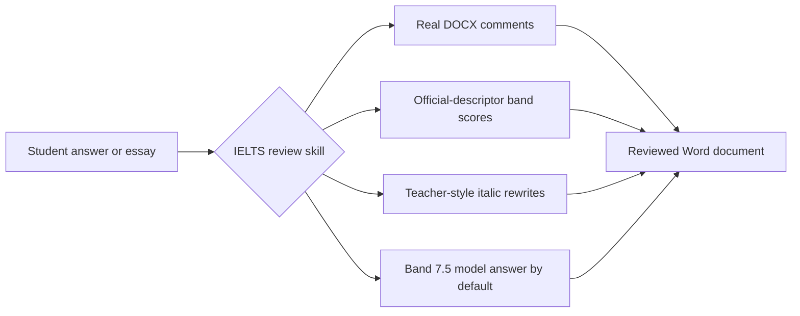

<div align="center">
  

  <h1>IELTS Writing Review Skills</h1>

  <p>
    Agent-ready IELTS Academic Writing Task 1 and Task 2 review skills for detailed DOCX feedback,
    official-descriptor scoring, teacher-style comments, and polished model answers.
  </p>

  <p>
    <a href="https://github.com/AaronL725/ielts-writing-review-skills/stargazers"></a>
    <a href="./LICENSE"></a>
    
    
    
  </p>
</div>

## What This Repo Gives You

This repository packages two local AI-agent skills for IELTS Writing review. They are designed for learners and tutors who want more than a generic essay critique: the skills produce teacher-style feedback, real Word comments, strict band scoring, concise rewrites, and model answers.

**Default target band: 7.5.** If you do not specify a target band, both skills calibrate the model answer or model essay to a stable Band 7.5 standard. You can override this in your prompt by writing `Target band: 7.0`, `Target band: 8.0`, or any other goal you want the reviewing agent to aim for.

| Skill | Best for | Default output |
| --- | --- | --- |
| `$ielts-task1-review` | Academic Task 1 charts, tables, maps, processes, and mixed visuals | Reviewed DOCX with comments, score, feedback, and a 4-paragraph Band 7.5 model answer |
| `$ielts-task2-review` | Task 2 opinion, discussion, problem-solution, advantages/disadvantages, and mixed essay prompts | Reviewed DOCX with comments, score, feedback, and a 4-paragraph Band 7.5 model essay |

## Highlights

| Real review behavior | Built-in IELTS knowledge | Agent-friendly packaging |
| --- | --- | --- |
| Adds real Word comments instead of plain bracket notes | Uses official IELTS band descriptors for scoring | Works as local skills for Codex and Claude Code |
| Anchors comments to the student's actual writing | Bundles teacher-style references and sample-derived rules | Includes scripts for DOCX extraction, creation, and validation |
| Adds concise italic rewrites after relevant units | Keeps Task 1 visual accuracy and Task 2 task response central | Preserves original documents and writes reviewed copies |
| Produces a score page plus focused next-step feedback | Generates realistic Band 7.5 model answers by default | Supports simple prompt-based target band customization |

## Review Workflow



## Install

Clone the repository first:

```bash
git clone https://github.com/AaronL725/ielts-writing-review-skills.git
cd ielts-writing-review-skills
```

### Codex

Install both skills into your Codex skills directory:

```bash
mkdir -p "${CODEX_HOME:-$HOME/.codex}/skills"
cp -R skills/ielts-task1-review skills/ielts-task2-review "${CODEX_HOME:-$HOME/.codex}/skills/"
```

### Claude Code

Install both skills as personal Claude Code skills:

```bash
mkdir -p "$HOME/.claude/skills"
cp -R skills/ielts-task1-review skills/ielts-task2-review "$HOME/.claude/skills/"
```

For a project-local install, copy them into the project's `.claude/skills` directory:

```bash
mkdir -p .claude/skills
cp -R skills/ielts-task1-review skills/ielts-task2-review .claude/skills/
```

### Universal Agent Install Prompt

```text
Install the IELTS Writing Review Skills from this GitHub repository: https://github.com/AaronL725/ielts-writing-review-skills and put the two skills into the correct local skills directory.
```

## Prompt Examples

```text
Use $ielts-task1-review to review my IELTS Academic Writing Task 1 answer: [paste the path of your answer]
```

```text
Use $ielts-task2-review to review my IELTS Writing Task 2 essay: [paste the path of your essay]
```

```text
Use $ielts-task1-review to review my IELTS Academic Writing Task 1 answer. Target band: [your target band]. File: [paste the path of your answer]
```

```text
Use $ielts-task2-review to review my IELTS Writing Task 2 essay. Target band: [your target band]. File: [paste the path of your essay]
```

## What Each Skill Bundles

The Task 1 skill includes a visual-analysis workflow, Task 1 band descriptors, teacher-style review rules, sample-derived references, sample images, DOCX extraction scripts, DOCX generation scripts, and validation scripts.

The Task 2 skill includes prompt and essay extraction, Task 2 band descriptors, teacher-style review rules, sample-derived references, matching logic for teacher samples, DOCX generation scripts, and validation scripts.

## Repository Structure

```text
.
|-- assets/
|   `-- ielts-skills-hero.svg
|-- skills/
|   |-- ielts-task1-review/
|   |   |-- SKILL.md
|   |   |-- agents/
|   |   |-- references/
|   |   `-- scripts/
|   `-- ielts-task2-review/
|       |-- SKILL.md
|       |-- agents/
|       |-- references/
|       `-- scripts/
|-- LICENSE
`-- README.md
```

## Compatibility

| Agent | Status | Notes |
| --- | --- | --- |
| Codex | Ready | Copy both folders into `$CODEX_HOME/skills`, usually `~/.codex/skills` |
| Claude Code | Ready | Copy both folders into `~/.claude/skills` or project `.claude/skills` |
| Other local agents | Manual | Use the universal install prompt and place each skill folder where your agent expects local skills |

## Star This Repo

If these skills save you time reviewing IELTS Writing, starring the repo helps other learners and tutors find it.
