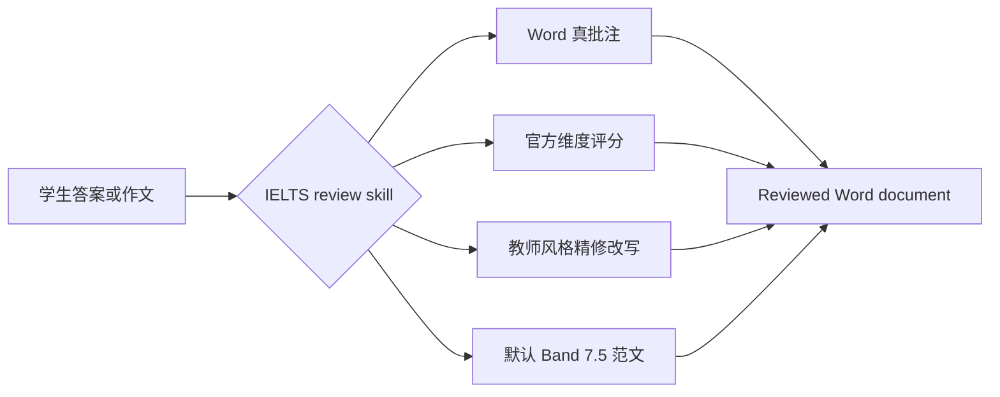

<div align="center">
  

  <h1>IELTS Writing Review Skills</h1>

  <p>
    面向 Codex 和 Claude Code 的 IELTS Academic Writing Task 1 / Task 2 本地批改技能。
    支持 DOCX 真批注、官方评分标准、教师风格点评、精修改写和范文生成。
  </p>

  <p>
    <a href="./README.md"><strong>简体中文</strong></a>
    · <a href="./docs/README.en.md">English</a>
    · <a href="./docs/README.ja.md">日本語</a>
    · <a href="./docs/README.ko.md">한국어</a>
    · <a href="./docs/README.es.md">Español</a>
  </p>

  <p>
    <a href="https://github.com/AaronL725/ielts-writing-review-skills/stargazers"></a>
    <a href="./LICENSE"></a>
    
    
    
  </p>
</div>

## 这个仓库是什么

这个仓库打包了两个 IELTS 写作批改 skills，让 AI agent 不只是给泛泛建议，而是按照接近真实老师的方式完成一整套批改流程：识别题目和学生原文、插入 Word 真批注、给出官方评分维度、添加局部精修改写，并生成对应的高质量范文。

**默认目标分数：Band 7.5。** 如果你不额外指定目标分，两个 skill 都会默认把范文和提升建议校准到稳定 Band 7.5 水平。你也可以在 prompt 里写 `Target band: 7.0`、`Target band: 8.0` 等，让 agent 按你的目标分调整反馈重点。

| Skill | 适合场景 | 默认输出 |
| --- | --- | --- |
| `$ielts-task1-review` | Academic Task 1 图表、表格、地图、流程图、混合图 | 带 Word 批注的 reviewed DOCX、评分、反馈、4 段 Band 7.5 范文 |
| `$ielts-task2-review` | Task 2 观点类、讨论类、问题解决类、利弊类、混合类作文 | 带 Word 批注的 reviewed DOCX、评分、反馈、4 段 Band 7.5 范文 |

## 核心亮点

| 真实批改体验 | IELTS 内置知识 | Agent 友好 |
| --- | --- | --- |
| 插入真实 Word comments，不是纯文本括号批注 | 使用官方 IELTS band descriptors 评分 | 可作为 Codex 和 Claude Code 本地 skill 使用 |
| 批注锚定学生原文，不批到题目或 outline 上 | 内置教师风格规则和样本提炼参考 | 包含 DOCX 提取、生成、验证脚本 |
| 在原文后插入简洁的 italic rewrite | Task 1 强制先看图，Task 2 强制先看任务回应 | 保留原文件，输出独立 reviewed copy |
| 输出分数页、短反馈和范文 | 默认生成真实可学的 Band 7.5 范文 | 可通过 prompt 自定义目标分 |

## 批改流程



## 安装

先克隆仓库：

```bash
git clone https://github.com/AaronL725/ielts-writing-review-skills.git
cd ielts-writing-review-skills
```

### Codex

把两个 skill 安装到 Codex skills 目录：

```bash
mkdir -p "${CODEX_HOME:-$HOME/.codex}/skills"
cp -R skills/ielts-task1-review skills/ielts-task2-review "${CODEX_HOME:-$HOME/.codex}/skills/"
```

### Claude Code

安装为 Claude Code 个人 skills：

```bash
mkdir -p "$HOME/.claude/skills"
cp -R skills/ielts-task1-review skills/ielts-task2-review "$HOME/.claude/skills/"
```

如果想只在某个项目中使用，可以复制到项目级 `.claude/skills`：

```bash
mkdir -p .claude/skills
cp -R skills/ielts-task1-review skills/ielts-task2-review .claude/skills/
```

### 通用 agent 安装提示词

```text
Install the IELTS Writing Review Skills from this GitHub repository: https://github.com/AaronL725/ielts-writing-review-skills and put the two skills into the correct local skills directory.
```

## Prompt 示例

```text
Use $ielts-task1-review to review my IELTS Academic Writing Task 1 answer: [paste the path of your answer]
```

```text
Use $ielts-task2-review to review my IELTS Writing Task 2 essay: [paste the path of your essay]
```

```text
Use $ielts-task1-review to review my IELTS Academic Writing Task 1 answer. Target band: [your target band]. File: [paste the path of your answer]
```

```text
Use $ielts-task2-review to review my IELTS Writing Task 2 essay. Target band: [your target band]. File: [paste the path of your essay]
```

## 每个 Skill 包含什么

Task 1 skill 包含视觉分析流程、Task 1 官方评分标准、教师风格批改规则、样本提炼参考、图表样本、DOCX 提取脚本、DOCX 生成脚本和验证脚本。

Task 2 skill 包含题目与作文提取、Task 2 官方评分标准、教师风格批改规则、样本提炼参考、教师样本匹配逻辑、DOCX 生成脚本和验证脚本。

## 仓库结构

```text
.
|-- assets/
|   `-- ielts-skills-hero.svg
|-- docs/
|   |-- README.en.md
|   |-- README.es.md
|   |-- README.ja.md
|   `-- README.ko.md
|-- skills/
|   |-- ielts-task1-review/
|   |   |-- SKILL.md
|   |   |-- agents/
|   |   |-- references/
|   |   `-- scripts/
|   `-- ielts-task2-review/
|       |-- SKILL.md
|       |-- agents/
|       |-- references/
|       `-- scripts/
|-- LICENSE
`-- README.md
```

## 兼容性

| Agent | 状态 | 说明 |
| --- | --- | --- |
| Codex | Ready | 复制到 `$CODEX_HOME/skills`，通常是 `~/.codex/skills` |
| Claude Code | Ready | 复制到 `~/.claude/skills` 或项目 `.claude/skills` |
| 其他本地 agents | Manual | 使用通用安装提示词，并把两个 skill 放到对应 agent 的本地 skills 目录 |

## 给这个仓库点 Star

如果这个仓库能节省你批改 IELTS Writing 的时间，点一个 star 可以帮助更多学习者和老师找到它。
