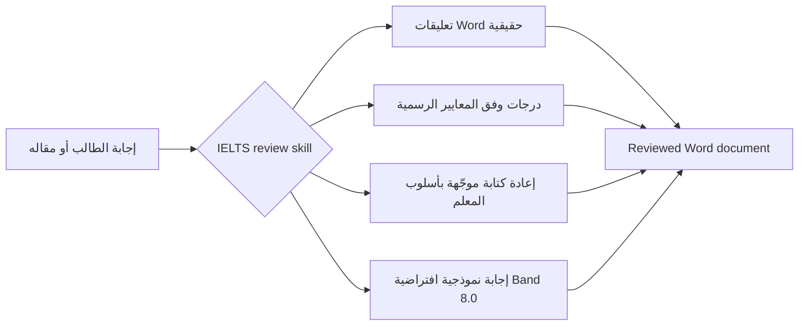

<div align="center">
  

  <h1>IELTS Writing Review Skills</h1>

  <p>
    مهارات محلية لمراجعة IELTS Academic Writing Task 1 / Task 2، مصممة لـ Codex وClaude Code.
    تدعم تعليقات DOCX حقيقية، ومعايير التقييم الرسمية، وملاحظات بأسلوب المعلم، وإعادة كتابة موجّهة، وإنشاء إجابات نموذجية.
  </p>

  <p>
    <a href="../README.md">简体中文</a>
    · <a href="./README.en.md">English</a>
    · <a href="./README.ja.md">日本語</a>
    · <a href="./README.ko.md">한국어</a>
    · <a href="./README.es.md">Español</a>
    · <a href="./README.vi.md">Tiếng Việt</a>
    · <a href="./README.hi.md">हिन्दी</a>
    · <a href="./README.ar.md"><strong>العربية</strong></a>
    · <a href="./README.fr.md">Français</a>
    · <a href="./README.bn.md">বাংলা</a>
    · <a href="./README.pt.md">Português</a>
    · <a href="./README.id.md">Bahasa Indonesia</a>
    · <a href="./README.ur.md">اردو</a>
    · <a href="./README.ru.md">Русский</a>
  </p>

  <p>
    <a href="https://github.com/AaronL725/ielts-writing-review-skills/stargazers"></a>
    <a href="../LICENSE"></a>
    
    
    
  </p>
</div>

## ما هذا المستودع؟

يجمع هذا المستودع مهارتين لمراجعة IELTS Writing، بحيث لا يقتصر AI agent على تقديم ملاحظات عامة، بل ينفّذ سير مراجعة كاملًا قريبًا من طريقة عمل المعلم الحقيقي: التعرّف على السؤال ونص الطالب الأصلي، وإدراج تعليقات Word حقيقية، ومنح الدرجات وفق المعايير الرسمية، وإضافة إعادة كتابة محسّنة لأجزاء محددة، ثم إنشاء إجابة نموذجية عالية الجودة تناسب المهمة.

**المستوى المستهدف افتراضيًا: إعادة الكتابة المائلة عند Band 7.5 بشكل ثابت، والإجابة النموذجية النهائية عند Band 8.0 بشكل ثابت.** إذا لم تحدد Band مستهدفًا آخر، تضبط المهارتان إعادة الكتابة المحلية المائلة على Band 7.5 ثابت، و`model answer` / `model essay` النهائي على Band 8.0 ثابت. ويمكنك أيضًا كتابة `Target band: 7.5` أو `Target band: 8.0` أو أي هدف آخر في الـ prompt ليعدّل agent تركيز الملاحظات وفقًا لهدفك.

| Skill | الاستخدام المناسب | المخرجات الافتراضية |
| --- | --- | --- |
| `$ielts-task1-review` | الرسوم البيانية والجداول والخرائط ومخططات العمليات والمرئيات المختلطة في Academic Task 1 | ملف reviewed DOCX يتضمن تعليقات Word، ودرجات، وملاحظات، وإعادة كتابة مائلة ثابتة عند Band 7.5، وإجابة نموذجية من 4 فقرات عند Band 8.0 |
| `$ielts-task2-review` | مقالات Task 2 من نوع الرأي، والمناقشة، والمشكلة والحل، والمزايا والعيوب، والأنواع المختلطة | ملف reviewed DOCX يتضمن تعليقات Word، ودرجات، وملاحظات، وإعادة كتابة مائلة ثابتة عند Band 7.5، ومقالًا نموذجيًا من 4 فقرات عند Band 8.0 |

## متطلبات ملف الإدخال

استخدم **ملف `.docx` لم تتم مراجعته من قبل** كمدخل. ملفات reviewed مخصصة فقط لمعاينة النتيجة، ولا ينبغي استخدامها مرة أخرى كمدخل لمراجعة جديدة.

| النوع | كيفية ترتيب مستند Word | ما يجب تجنبه |
| --- | --- | --- |
| Task 1 | ضع نص السؤال أولًا؛ ثم ضع الرسم البياني/الخريطة/مخطط العملية بعده كصورة مضمنة في Word؛ وضع إجابة الطالب بعد الصورة مع فصلها إلى فقرات عادية | لا تضع إجابة الطالب قبل الصورة؛ لا تحذف العنصر البصري؛ ولا تخلط الدرجات القديمة أو الإجابات النموذجية أو التعليقات السابقة داخل ملف الإدخال |
| Task 2 | ضع السؤال كاملًا في البداية؛ وإذا كان هناك outline، فيمكن وضعه بعد السؤال وقبل المقال الرسمي؛ ثم ضع المقال الرسمي في النهاية مع فصله إلى فقرات عادية | لا تضع السؤال بعد المقال؛ لا تعامل الـ outline على أنه المقال الرسمي؛ ولا تضف الملاحظات القديمة أو الإجابات النموذجية أو المحتوى reviewed إلى ملف الإدخال |

ترتيب هذه العناصر مهم، لأن skill يميّز أولًا بين السؤال والصور والـ outline ونص الطالب الأساسي، ثم يربط تعليقات Word بفقرات نص الطالب نفسه.

## ملفات الأمثلة

يحتوي مجلد `examples/` في المستودع على مجموعة من أمثلة Task 1 وTask 2. الملفات التي لا تحتوي أسماؤها على `(reviewed)` هي أمثلة إدخال، أما الملفات التي تحتوي على `(reviewed)` فهي معاينات للنتيجة بعد المراجعة.

| المثال | الملف |
| --- | --- |
| إدخال Task 1 | [C19T4 Writing Task 1.docx](<../examples/C19T4 Writing Task 1.docx>) |
| مخرج Task 1 reviewed | [C19T4 Writing Task 1(reviewed).docx](<../examples/C19T4 Writing Task 1(reviewed).docx>) |
| إدخال Task 2 | [C19T4 Writing Task 2.docx](<../examples/C19T4 Writing Task 2.docx>) |
| مخرج Task 2 reviewed | [C19T4 Writing Task 2(reviewed).docx](<../examples/C19T4 Writing Task 2(reviewed).docx>) |

## أبرز الميزات

| تجربة مراجعة واقعية | معرفة IELTS مدمجة | مناسب للـ Agent |
| --- | --- | --- |
| يضيف تعليقات Word حقيقية بدل ملاحظات نصية بين أقواس | يستخدم IELTS band descriptors الرسمية في التقييم | يمكن استخدامه كـ local skill مع Codex وClaude Code |
| يربط التعليقات بنص الطالب الأصلي، لا بالسؤال أو الـ outline | يتضمن قواعد بأسلوب المعلم ومراجع مستخلصة من العينات | يتضمن scripts لاستخراج DOCX وإنشائه والتحقق منه |
| يضيف italic rewrite مختصرًا بعد النص الأصلي | يشترط Task 1 فحص العنصر البصري أولًا، ويشترط Task 2 فحص task response أولًا | يحافظ على الملف الأصلي وينشئ reviewed copy مستقلة |
| ينشئ صفحة درجات وملاحظات قصيرة وإجابة نموذجية | إعادة الكتابة المائلة افتراضيًا Band 7.5، والإجابة النموذجية النهائية Band 8.0 | يمكن تخصيص target band عبر الـ prompt |

## سير المراجعة



## التثبيت

### Prompt تثبيت عام للـ agents

```text
Install the IELTS Writing Review Skills from this GitHub repository: https://github.com/AaronL725/ielts-writing-review-skills and put the two skills into the correct local skills directory.
```

يمكنك أيضًا التثبيت يدويًا.

استنسخ المستودع أولًا:

```bash
git clone https://github.com/AaronL725/ielts-writing-review-skills.git
cd ielts-writing-review-skills
```

### Codex

ثبّت المهارتين في مجلد skills الخاص بـ Codex:

```bash
mkdir -p "${CODEX_HOME:-$HOME/.codex}/skills"
cp -R skills/ielts-task1-review skills/ielts-task2-review "${CODEX_HOME:-$HOME/.codex}/skills/"
```

### Claude Code

ثبّتهما كـ personal skills في Claude Code:

```bash
mkdir -p "$HOME/.claude/skills"
cp -R skills/ielts-task1-review skills/ielts-task2-review "$HOME/.claude/skills/"
```

إذا أردت استخدامهما داخل مشروع واحد فقط، فانسخهما إلى `.claude/skills` على مستوى المشروع:

```bash
mkdir -p .claude/skills
cp -R skills/ielts-task1-review skills/ielts-task2-review .claude/skills/
```

## أمثلة Prompt

```text
Use $ielts-task1-review to review my IELTS Academic Writing Task 1 answer: [paste the path of your answer]
```

```text
Use $ielts-task2-review to review my IELTS Writing Task 2 essay: [paste the path of your essay]
```

```text
Use $ielts-task1-review to review my IELTS Academic Writing Task 1 answer. Target band: [your target band]. File: [paste the path of your answer]
```

```text
Use $ielts-task2-review to review my IELTS Writing Task 2 essay. Target band: [your target band]. File: [paste the path of your essay]
```

## ماذا تتضمن كل Skill؟

تتضمن Skill الخاصة بـ Task 1 سير تحليل بصري، ومعايير التقييم الرسمية لـ Task 1، وقواعد مراجعة بأسلوب المعلم، ومراجع لاستخلاص الأنماط من العينات، وعينات رسوم بيانية، وscripts لاستخراج DOCX وإنشائه والتحقق منه.

وتتضمن Skill الخاصة بـ Task 2 استخراج السؤال والمقال، ومعايير التقييم الرسمية لـ Task 2، وقواعد مراجعة بأسلوب المعلم، ومراجع لاستخلاص الأنماط من العينات، ومنطق مطابقة عينات المعلم، وscripts لإنشاء DOCX والتحقق منه.

## بنية المستودع

```text
.
|-- assets/
|   `-- ielts-writing-review-skills-hero.png
|-- docs/
|   |-- README.ar.md
|   |-- README.bn.md
|   |-- README.en.md
|   |-- README.es.md
|   |-- README.fr.md
|   |-- README.hi.md
|   |-- README.id.md
|   |-- README.ja.md
|   |-- README.ko.md
|   |-- README.pt.md
|   |-- README.ru.md
|   |-- README.ur.md
|   `-- README.vi.md
|-- examples/
|   |-- C19T4 Writing Task 1.docx
|   |-- C19T4 Writing Task 1(reviewed).docx
|   |-- C19T4 Writing Task 2.docx
|   `-- C19T4 Writing Task 2(reviewed).docx
|-- skills/
|   |-- ielts-task1-review/
|   |   |-- SKILL.md
|   |   |-- agents/
|   |   |-- references/
|   |   `-- scripts/
|   `-- ielts-task2-review/
|       |-- SKILL.md
|       |-- agents/
|       |-- references/
|       `-- scripts/
|-- LICENSE
`-- README.md
```

## التوافق

| Agent | الحالة | الوصف |
| --- | --- | --- |
| Codex | Ready | انسخ المهارتين إلى `$CODEX_HOME/skills`، وهو عادةً `~/.codex/skills` |
| Claude Code | Ready | انسخهما إلى `~/.claude/skills` أو إلى `.claude/skills` الخاصة بالمشروع |
| Agents محلية أخرى | Manual | استخدم prompt التثبيت العام وضع المهارتين في مجلد local skills المناسب لكل agent |

## ⭐️ ضع Star لهذا المستودع

إذا كان هذا المستودع يوفر عليك وقت مراجعة IELTS Writing، فإن إضافة star تساعد المزيد من المتعلمين والمعلمين على العثور عليه.