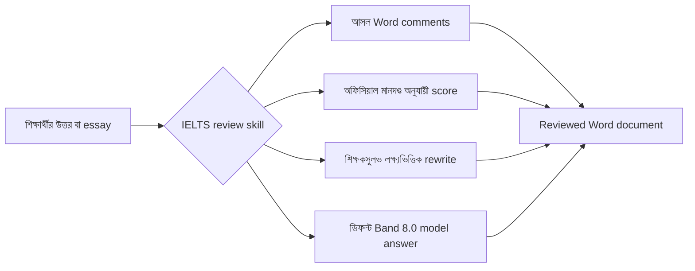

<div align="center">
  

  <h1>IELTS Writing Review Skills</h1>

  <p>
    Codex ও Claude Code-এর জন্য তৈরি IELTS Academic Writing Task 1 / Task 2-এর লোকাল রিভিউ skill।
    এগুলো DOCX-এ আসল comment, অফিসিয়াল মূল্যায়ন মানদণ্ড, শিক্ষকসুলভ feedback, লক্ষ্যভিত্তিক rewrite এবং model answer তৈরি সমর্থন করে।
  </p>

  <p>
    <a href="../README.md">简体中文</a>
    · <a href="./README.en.md">English</a>
    · <a href="./README.ja.md">日本語</a>
    · <a href="./README.ko.md">한국어</a>
    · <a href="./README.es.md">Español</a>
    · <a href="./README.vi.md">Tiếng Việt</a>
    · <a href="./README.hi.md">हिन्दी</a>
    · <a href="./README.ar.md">العربية</a>
    · <a href="./README.fr.md">Français</a>
    · <a href="./README.bn.md"><strong>বাংলা</strong></a>
    · <a href="./README.pt.md">Português</a>
    · <a href="./README.id.md">Bahasa Indonesia</a>
    · <a href="./README.ur.md">اردو</a>
    · <a href="./README.ru.md">Русский</a>
  </p>

  <p>
    <a href="https://github.com/AaronL725/ielts-writing-review-skills/stargazers"></a>
    <a href="../LICENSE"></a>
    
    
    
  </p>
</div>

## এই রিপোজিটরি কী?

এই রিপোজিটরিতে IELTS Writing রিভিউ করার জন্য দুটি skill প্যাকেজ করা হয়েছে। এর উদ্দেশ্য হলো AI agent-কে শুধু সাধারণ পরামর্শ দেওয়ার মধ্যে সীমাবদ্ধ না রেখে, একজন বাস্তব শিক্ষকের কাজের কাছাকাছি একটি পূর্ণাঙ্গ রিভিউ প্রক্রিয়া সম্পন্ন করতে দেওয়া: প্রশ্ন ও শিক্ষার্থীর মূল লেখা শনাক্ত করা, Word-এ আসল comment যোগ করা, অফিসিয়াল মানদণ্ড অনুযায়ী স্কোর দেওয়া, নির্দিষ্ট অংশে উন্নত rewrite যোগ করা এবং সংশ্লিষ্ট উচ্চমানের model answer তৈরি করা।

**ডিফল্ট লক্ষ্য: italic rewrite স্থিতিশীল Band 7.5 এবং শেষের model answer স্থিতিশীল Band 8.0।** আপনি আলাদা target band না দিলে, দুটি skill-ই স্থানীয় italic rewrite-কে স্থিতিশীল Band 7.5 এবং শেষের `model answer` / `model essay`-কে স্থিতিশীল Band 8.0 অনুযায়ী ক্যালিব্রেট করবে। Prompt-এ `Target band: 7.5`, `Target band: 8.0` বা অন্য কোনো লক্ষ্য লিখে agent-কে সেই অনুযায়ী feedback-এর গুরুত্ব বদলাতেও বলতে পারেন।

| Skill | উপযুক্ত ক্ষেত্র | ডিফল্ট আউটপুট |
| --- | --- | --- |
| `$ielts-task1-review` | Academic Task 1-এর chart, table, map, process diagram এবং mixed visual | Word comments, score, feedback, স্থিতিশীল Band 7.5 italic rewrite এবং 4-প্যারাগ্রাফ Band 8.0 model answer-সহ reviewed DOCX |
| `$ielts-task2-review` | Task 2-এর opinion, discussion, problem-solution, advantages/disadvantages এবং mixed essay | Word comments, score, feedback, স্থিতিশীল Band 7.5 italic rewrite এবং 4-প্যারাগ্রাফ Band 8.0 model essay-সহ reviewed DOCX |

## ইনপুট ফাইলের প্রয়োজনীয়তা

ইনপুট হিসেবে **আগে রিভিউ করা হয়নি এমন `.docx` ফাইল** ব্যবহার করুন। Reviewed ফাইল শুধু ফলাফল preview করার জন্য; সেটিকে আবার নতুন রিভিউয়ের ইনপুট হিসেবে ব্যবহার করবেন না।

| ধরন | Word ডকুমেন্টে কীভাবে সাজাবেন | যা করবেন না |
| --- | --- | --- |
| Task 1 | প্রশ্নের লেখা একেবারে শুরুতে রাখুন; chart/map/process diagram-কে Word-এর embedded image হিসেবে প্রশ্নের পরে রাখুন; শিক্ষার্থীর উত্তর image-এর পরে সাধারণ paragraph-এ সাজান | শিক্ষার্থীর উত্তর image-এর আগে রাখবেন না; visual বাদ দেবেন না; পুরোনো score, model answer বা comment ইনপুট ফাইলে মেশাবেন না |
| Task 2 | পূর্ণ প্রশ্ন একেবারে শুরুতে রাখুন; outline থাকলে প্রশ্নের পরে এবং মূল essay-এর আগে রাখতে পারেন; মূল essay শেষে সাধারণ paragraph-এ রাখুন | প্রশ্ন essay-এর পরে রাখবেন না; outline-কে মূল essay হিসেবে ধরবেন না; পুরোনো feedback, model answer বা reviewed content ইনপুট ফাইলে রাখবেন না |

এই অবস্থানগুলো গুরুত্বপূর্ণ, কারণ skill প্রথমে প্রশ্ন, image, outline এবং শিক্ষার্থীর মূল লেখা আলাদা করে শনাক্ত করে, তারপর Word comments শিক্ষার্থীর লেখার paragraph-গুলোর সঙ্গে anchor করে।

## উদাহরণ ফাইল

রিপোজিটরির `examples/` ডিরেক্টরিতে Task 1 এবং Task 2-এর একটি করে example set রয়েছে। যেসব ফাইলে `(reviewed)` নেই সেগুলো input example, আর `(reviewed)` থাকা ফাইলগুলো review-এর পরের output preview।

| উদাহরণ | ফাইল |
| --- | --- |
| Task 1 input | [C19T4 Writing Task 1.docx](<../examples/C19T4 Writing Task 1.docx>) |
| Task 1 reviewed output | [C19T4 Writing Task 1(reviewed).docx](<../examples/C19T4 Writing Task 1(reviewed).docx>) |
| Task 2 input | [C19T4 Writing Task 2.docx](<../examples/C19T4 Writing Task 2.docx>) |
| Task 2 reviewed output | [C19T4 Writing Task 2(reviewed).docx](<../examples/C19T4 Writing Task 2(reviewed).docx>) |

## প্রধান বৈশিষ্ট্য

| বাস্তবসম্মত রিভিউ অভিজ্ঞতা | Built-in IELTS জ্ঞান | Agent-friendly |
| --- | --- | --- |
| plain-text bracket note নয়, আসল Word comments যোগ করে | অফিসিয়াল IELTS band descriptors দিয়ে স্কোর করে | Codex ও Claude Code-এর local skill হিসেবে ব্যবহার করা যায় |
| comment প্রশ্ন বা outline-এ নয়, শিক্ষার্থীর মূল লেখায় anchor করে | শিক্ষকসুলভ নিয়ম ও sample-extraction reference অন্তর্ভুক্ত | DOCX extraction, generation ও validation script অন্তর্ভুক্ত |
| মূল লেখার পরে সংক্ষিপ্ত italic rewrite যোগ করে | Task 1-এ আগে visual দেখা বাধ্যতামূলক; Task 2-এ আগে task response দেখা বাধ্যতামূলক | মূল ফাইল অক্ষত রাখে এবং আলাদা reviewed copy তৈরি করে |
| score page, সংক্ষিপ্ত feedback ও model answer তৈরি করে | italic rewrite ডিফল্ট Band 7.5, শেষের model answer Band 8.0 | prompt থেকে target band কাস্টমাইজ করা যায় |

## রিভিউ প্রক্রিয়া



## ইনস্টলেশন

### সাধারণ agent-এর জন্য installation prompt

```text
Install the IELTS Writing Review Skills from this GitHub repository: https://github.com/AaronL725/ielts-writing-review-skills and put the two skills into the correct local skills directory.
```

চাইলে ম্যানুয়ালভাবেও ইনস্টল করতে পারেন।

প্রথমে রিপোজিটরি clone করুন:

```bash
git clone https://github.com/AaronL725/ielts-writing-review-skills.git
cd ielts-writing-review-skills
```

### Codex

দুটি skill Codex skills ডিরেক্টরিতে ইনস্টল করুন:

```bash
mkdir -p "${CODEX_HOME:-$HOME/.codex}/skills"
cp -R skills/ielts-task1-review skills/ielts-task2-review "${CODEX_HOME:-$HOME/.codex}/skills/"
```

### Claude Code

Claude Code personal skills হিসেবে ইনস্টল করুন:

```bash
mkdir -p "$HOME/.claude/skills"
cp -R skills/ielts-task1-review skills/ielts-task2-review "$HOME/.claude/skills/"
```

শুধু নির্দিষ্ট একটি project-এ ব্যবহার করতে চাইলে project-level `.claude/skills`-এ কপি করুন:

```bash
mkdir -p .claude/skills
cp -R skills/ielts-task1-review skills/ielts-task2-review .claude/skills/
```

## Prompt উদাহরণ

```text
Use $ielts-task1-review to review my IELTS Academic Writing Task 1 answer: [paste the path of your answer]
```

```text
Use $ielts-task2-review to review my IELTS Writing Task 2 essay: [paste the path of your essay]
```

```text
Use $ielts-task1-review to review my IELTS Academic Writing Task 1 answer. Target band: [your target band]. File: [paste the path of your answer]
```

```text
Use $ielts-task2-review to review my IELTS Writing Task 2 essay. Target band: [your target band]. File: [paste the path of your essay]
```

## প্রতিটি Skill-এ কী আছে?

Task 1 skill-এ visual-analysis workflow, Task 1-এর অফিসিয়াল scoring criteria, teacher-style review rules, sample-extraction references, chart samples, DOCX extraction scripts, DOCX generation scripts এবং validation scripts রয়েছে।

Task 2 skill-এ task ও essay extraction, Task 2-এর অফিসিয়াল scoring criteria, teacher-style review rules, sample-extraction references, teacher-sample matching logic, DOCX generation scripts এবং validation scripts রয়েছে।

## রিপোজিটরি কাঠামো

```text
.
|-- assets/
|   `-- ielts-writing-review-skills-hero.png
|-- docs/
|   |-- README.ar.md
|   |-- README.bn.md
|   |-- README.en.md
|   |-- README.es.md
|   |-- README.fr.md
|   |-- README.hi.md
|   |-- README.id.md
|   |-- README.ja.md
|   |-- README.ko.md
|   |-- README.pt.md
|   |-- README.ru.md
|   |-- README.ur.md
|   `-- README.vi.md
|-- examples/
|   |-- C19T4 Writing Task 1.docx
|   |-- C19T4 Writing Task 1(reviewed).docx
|   |-- C19T4 Writing Task 2.docx
|   `-- C19T4 Writing Task 2(reviewed).docx
|-- skills/
|   |-- ielts-task1-review/
|   |   |-- SKILL.md
|   |   |-- agents/
|   |   |-- references/
|   |   `-- scripts/
|   `-- ielts-task2-review/
|       |-- SKILL.md
|       |-- agents/
|       |-- references/
|       `-- scripts/
|-- LICENSE
`-- README.md
```

## সামঞ্জস্যতা

| Agent | অবস্থা | বিবরণ |
| --- | --- | --- |
| Codex | Ready | `$CODEX_HOME/skills`-এ কপি করুন, সাধারণত এটি `~/.codex/skills` |
| Claude Code | Ready | `~/.claude/skills` অথবা project-এর `.claude/skills`-এ কপি করুন |
| অন্যান্য local agents | Manual | সাধারণ installation prompt ব্যবহার করে দুটি skill সংশ্লিষ্ট agent-এর local skills ডিরেক্টরিতে রাখুন |

## ⭐️ এই রিপোজিটরিতে Star দিন

এই রিপোজিটরি যদি IELTS Writing রিভিউতে আপনার সময় বাঁচায়, একটি star আরও বেশি শিক্ষার্থী ও শিক্ষককে এটি খুঁজে পেতে সাহায্য করতে পারে।