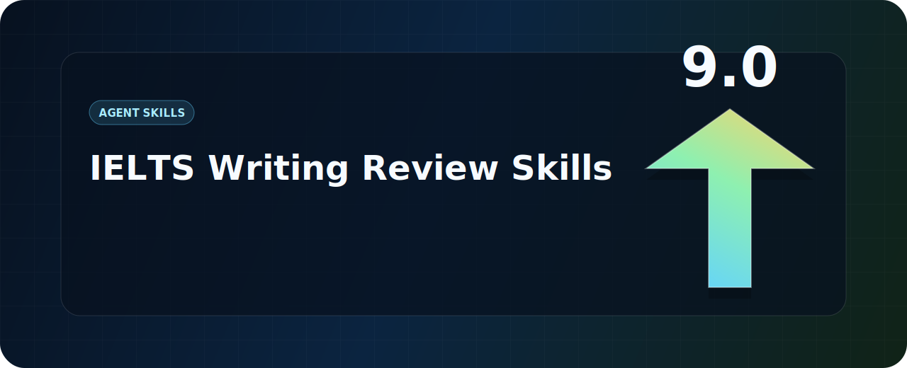

<div align="center">
  

  <h1>IELTS Writing Review Skills</h1>

  <p>
    Local IELTS Academic Writing Task 1 and Task 2 review skills for Codex and Claude Code,
    with real DOCX comments, official scoring, teacher-style feedback, rewrites, and model answers.
  </p>

  <p>
    <a href="../README.md">简体中文</a>
    · <a href="./README.en.md"><strong>English</strong></a>
    · <a href="./README.ja.md">日本語</a>
    · <a href="./README.ko.md">한국어</a>
    · <a href="./README.es.md">Español</a>
  </p>
</div>

## What This Repo Is

This repository packages two IELTS Writing review skills for local AI agents. They are designed to do more than generic essay critique: each skill identifies the task and student writing, inserts real Word comments, scores with official IELTS descriptors, adds concise rewrites, and generates a high-quality model answer.

**Default target band: 7.5.** If you do not specify a target band, both skills calibrate model answers and feedback to a stable Band 7.5 level. You can override this in your prompt with `Target band: 7.0`, `Target band: 8.0`, or another goal.

| Skill | Best for | Default output |
| --- | --- | --- |
| `$ielts-task1-review` | Academic Task 1 charts, tables, maps, processes, and mixed visuals | Reviewed DOCX with comments, score, feedback, and a 4-paragraph Band 7.5 model answer |
| `$ielts-task2-review` | Task 2 opinion, discussion, problem-solution, advantages/disadvantages, and mixed essay prompts | Reviewed DOCX with comments, score, feedback, and a 4-paragraph Band 7.5 model essay |

## Install

```bash
git clone https://github.com/AaronL725/ielts-writing-review-skills.git
cd ielts-writing-review-skills
```

For Codex:

```bash
mkdir -p "${CODEX_HOME:-$HOME/.codex}/skills"
cp -R skills/ielts-task1-review skills/ielts-task2-review "${CODEX_HOME:-$HOME/.codex}/skills/"
```

For Claude Code:

```bash
mkdir -p "$HOME/.claude/skills"
cp -R skills/ielts-task1-review skills/ielts-task2-review "$HOME/.claude/skills/"
```

Universal install prompt:

```text
Install the IELTS Writing Review Skills from this GitHub repository: https://github.com/AaronL725/ielts-writing-review-skills and put the two skills into the correct local skills directory.
```

## Prompt Examples

```text
Use $ielts-task1-review to review my IELTS Academic Writing Task 1 answer: [paste the path of your answer]
```

```text
Use $ielts-task2-review to review my IELTS Writing Task 2 essay: [paste the path of your essay]
```

```text
Use $ielts-task2-review to review my IELTS Writing Task 2 essay. Target band: [your target band]. File: [paste the path of your essay]
```

## Highlights

| Real review behavior | Built-in IELTS knowledge | Agent-friendly packaging |
| --- | --- | --- |
| Real Word comments | Official IELTS band descriptors | Local skills for Codex and Claude Code |
| Comments anchored to student writing | Teacher-style sample references | DOCX extraction, generation, and validation scripts |
| Concise italic rewrites | Task 1 visual accuracy and Task 2 task response | Original files preserved, reviewed copies generated |

## Repository Structure

```text
.
|-- assets/
|-- docs/
|-- skills/
|   |-- ielts-task1-review/
|   `-- ielts-task2-review/
|-- LICENSE
`-- README.md
```
