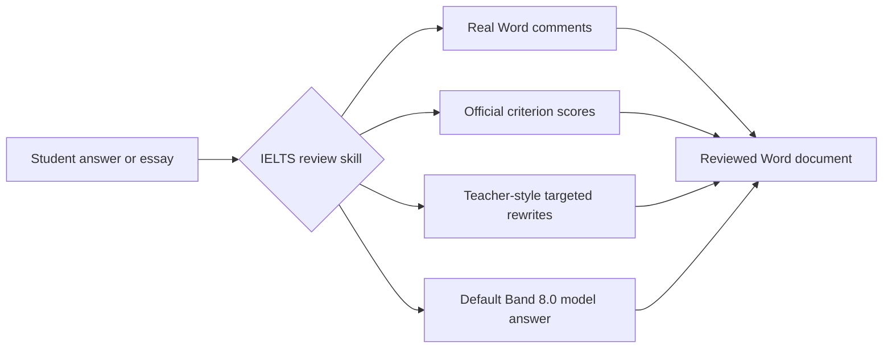

<div align="center">
  

  <h1>IELTS Writing Review Skills</h1>

  <p>
    Local review skills for IELTS Academic Writing Task 1 and Task 2, designed for Codex and Claude Code.
    They support real DOCX comments, official scoring criteria, teacher-style feedback, targeted rewrites, and model-answer generation.
  </p>

  <p>
    <a href="../README.md">简体中文</a>
    · <a href="./README.en.md"><strong>English</strong></a>
    · <a href="./README.ja.md">日本語</a>
    · <a href="./README.ko.md">한국어</a>
    · <a href="./README.es.md">Español</a>
    · <a href="./README.vi.md">Tiếng Việt</a>
    · <a href="./README.hi.md">हिन्दी</a>
    · <a href="./README.ar.md">العربية</a>
    · <a href="./README.fr.md">Français</a>
    · <a href="./README.bn.md">বাংলা</a>
    · <a href="./README.pt.md">Português</a>
    · <a href="./README.id.md">Bahasa Indonesia</a>
    · <a href="./README.ur.md">اردو</a>
    · <a href="./README.ru.md">Русский</a>
  </p>

  <p>
    <a href="https://github.com/AaronL725/ielts-writing-review-skills/stargazers"></a>
    <a href="../LICENSE"></a>
    
    
    
  </p>
</div>

## What is this repository?

This repository packages two IELTS Writing review skills. Instead of giving only generic advice, they enable an AI agent to complete a full review workflow similar to that of a real teacher: identify the task and the student's original writing, insert real Word comments, score the response against the official criteria, add targeted section-level rewrites, and generate a corresponding high-quality model answer.

**Default target level: stable Band 7.5 italic rewrites and a stable Band 8.0 final model answer.** Unless you specify another target band, both skills calibrate the local italic rewrites to a consistent Band 7.5 and the final model answer or model essay to a consistent Band 8.0. You can also include `Target band: 7.5`, `Target band: 8.0`, or another target in your prompt so that the agent adjusts the focus of its feedback accordingly.

| Skill | Recommended scenarios | Default output |
| --- | --- | --- |
| `$ielts-task1-review` | Academic Task 1 charts, tables, maps, process diagrams, and mixed visuals | Reviewed DOCX with Word comments, scores, feedback, stable Band 7.5 italic rewrites, and a four-paragraph Band 8.0 model answer |
| `$ielts-task2-review` | Task 2 opinion, discussion, problem-solution, advantages/disadvantages, and mixed essay types | Reviewed DOCX with Word comments, scores, feedback, stable Band 7.5 italic rewrites, and a four-paragraph Band 8.0 model essay |

## Input file requirements

Use an **unreviewed `.docx` file** as the input. Reviewed files are intended only as output previews and should not be submitted for another round of review.

| Type | How to arrange the Word document | What to avoid |
| --- | --- | --- |
| Task 1 | Put the task text first; place the chart, map, or process diagram after it as an image embedded in Word; put the student's response after the image and separate it into normal paragraphs. | Do not put the student's response before the image; do not omit the visual; do not include old scores, model answers, or comments in the input file. |
| Task 2 | Put the complete task first; if there is an outline, place it after the task and before the formal essay; put the formal essay last and separate it into normal paragraphs. | Do not put the task after the essay; do not treat the outline as the formal essay; do not include old feedback, model answers, or reviewed content in the input file. |

These positions matter because the skill first distinguishes the task, images, outline, and main student response, and then anchors Word comments to the paragraphs of the student's writing.

## Example files

The repository's `examples/` directory contains one set of Task 1 and Task 2 examples. Files without `(reviewed)` are sample inputs, while files with `(reviewed)` show the reviewed output.

| Example | File |
| --- | --- |
| Task 1 input | [C19T4 Writing Task 1.docx](<../examples/C19T4 Writing Task 1.docx>) |
| Task 1 reviewed output | [C19T4 Writing Task 1(reviewed).docx](<../examples/C19T4 Writing Task 1(reviewed).docx>) |
| Task 2 input | [C19T4 Writing Task 2.docx](<../examples/C19T4 Writing Task 2.docx>) |
| Task 2 reviewed output | [C19T4 Writing Task 2(reviewed).docx](<../examples/C19T4 Writing Task 2(reviewed).docx>) |

## Key features

| Real review experience | Built-in IELTS knowledge | Agent-friendly |
| --- | --- | --- |
| Inserts real Word comments rather than plain-text notes in parentheses | Uses the official IELTS band descriptors for scoring | Works as a local skill for Codex and Claude Code |
| Anchors comments to the student's original writing, not to the task or outline | Includes teacher-style rules and sample-extraction references | Includes scripts for DOCX extraction, generation, and validation |
| Inserts a concise italic rewrite after the original text | Task 1 requires checking the visual first; Task 2 requires checking task response first | Preserves the original file and creates a separate reviewed copy |
| Generates a score page, brief feedback, and a model answer | Italic rewrites default to Band 7.5; the final model answer defaults to Band 8.0 | Supports a custom target band in the prompt |

## Review workflow


```mermaid
flowchart LR
    A[Student answer or essay] --> B{IELTS review skill}
    B --> C[Real Word comments]
    B --> D[Official criterion scores]
    B --> E[Teacher-style targeted rewrites]
    B --> F[Default Band 8.0 model answer]
    C --> G[Reviewed Word document]
    D --> G
    E --> G
    F --> G
```

## Installation

### Installation prompt for general-purpose agents

```text
Install the IELTS Writing Review Skills from this GitHub repository: https://github.com/AaronL725/ielts-writing-review-skills and put the two skills into the correct local skills directory.
```

You can also install them manually.

First, clone the repository:

```bash
git clone https://github.com/AaronL725/ielts-writing-review-skills.git
cd ielts-writing-review-skills
```

### Codex

Install both skills in the Codex skills directory:

```bash
mkdir -p "${CODEX_HOME:-$HOME/.codex}/skills"
cp -R skills/ielts-task1-review skills/ielts-task2-review "${CODEX_HOME:-$HOME/.codex}/skills/"
```

### Claude Code

Install them as personal Claude Code skills:

```bash
mkdir -p "$HOME/.claude/skills"
cp -R skills/ielts-task1-review skills/ielts-task2-review "$HOME/.claude/skills/"
```

To use them only in a specific project, copy them to the project-level `.claude/skills` directory:

```bash
mkdir -p .claude/skills
cp -R skills/ielts-task1-review skills/ielts-task2-review .claude/skills/
```

## Prompt examples

```text
Use $ielts-task1-review to review my IELTS Academic Writing Task 1 answer: [paste the path of your answer]
```

```text
Use $ielts-task2-review to review my IELTS Writing Task 2 essay: [paste the path of your essay]
```

```text
Use $ielts-task1-review to review my IELTS Academic Writing Task 1 answer. Target band: [your target band]. File: [paste the path of your answer]
```

```text
Use $ielts-task2-review to review my IELTS Writing Task 2 essay. Target band: [your target band]. File: [paste the path of your essay]
```

## What does each skill include?

The Task 1 skill includes a visual-analysis workflow, the official Task 1 scoring criteria, teacher-style review rules, sample-extraction references, chart samples, DOCX extraction scripts, DOCX generation scripts, and validation scripts.

The Task 2 skill includes task and essay extraction, the official Task 2 scoring criteria, teacher-style review rules, sample-extraction references, teacher-sample matching logic, DOCX generation scripts, and validation scripts.

## Repository structure

```text
.
|-- assets/
|   `-- ielts-writing-review-skills-hero.png
|-- docs/
|   |-- README.ar.md
|   |-- README.bn.md
|   |-- README.en.md
|   |-- README.es.md
|   |-- README.fr.md
|   |-- README.hi.md
|   |-- README.id.md
|   |-- README.ja.md
|   |-- README.ko.md
|   |-- README.pt.md
|   |-- README.ru.md
|   |-- README.ur.md
|   `-- README.vi.md
|-- examples/
|   |-- C19T4 Writing Task 1.docx
|   |-- C19T4 Writing Task 1(reviewed).docx
|   |-- C19T4 Writing Task 2.docx
|   `-- C19T4 Writing Task 2(reviewed).docx
|-- skills/
|   |-- ielts-task1-review/
|   |   |-- SKILL.md
|   |   |-- agents/
|   |   |-- references/
|   |   `-- scripts/
|   `-- ielts-task2-review/
|       |-- SKILL.md
|       |-- agents/
|       |-- references/
|       `-- scripts/
|-- LICENSE
`-- README.md
```

## Compatibility

| Agent | Status | Description |
| --- | --- | --- |
| Codex | Ready | Copy the skills to `$CODEX_HOME/skills`, normally `~/.codex/skills` |
| Claude Code | Ready | Copy the skills to `~/.claude/skills` or the project's `.claude/skills` directory |
| Other local agents | Manual | Use the general installation prompt and place both skills in the appropriate local skills directory for the agent |

## ⭐️ Star this repository

If this repository saves you time when reviewing IELTS Writing, giving it a star can help more learners and teachers discover it.