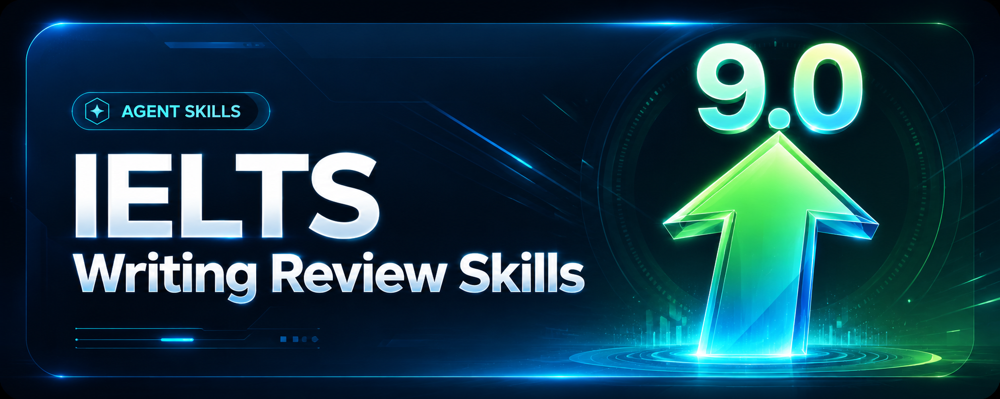

<div align="center">
  

  <h1>IELTS Writing Review Skills</h1>

  <p>
    Skills locales para revisar IELTS Academic Writing Task 1 y Task 2 con Codex y Claude Code:
    comentarios reales en DOCX, puntuacion oficial, feedback estilo profesor, reescrituras y modelos.
  </p>

  <p>
    <a href="../README.md">简体中文</a>
    · <a href="./README.en.md">English</a>
    · <a href="./README.ja.md">日本語</a>
    · <a href="./README.ko.md">한국어</a>
    · <a href="./README.es.md"><strong>Español</strong></a>
  </p>
</div>

## Que es este repositorio

Este repositorio incluye dos skills para que un AI agent local revise IELTS Writing. No se limita a dar comentarios genericos: identifica la tarea y la respuesta del estudiante, inserta comentarios reales en Word, puntua con los descriptores oficiales de IELTS, agrega reescrituras breves y genera una respuesta modelo.

**Niveles objetivo predeterminados: reescrituras en cursiva de Band 7.5 estable y modelo final de Band 8.0 estable.** Si no indicas una banda objetivo, ambos skills calibran las reescrituras locales a Band 7.5 y la respuesta o ensayo modelo final a Band 8.0. Puedes cambiarlo en el prompt con `Target band: 7.5`, `Target band: 8.0` u otro objetivo.

| Skill | Uso principal | Salida predeterminada |
| --- | --- | --- |
| `$ielts-task1-review` | Graficos, tablas, mapas, procesos y visuales mixtos de Academic Task 1 | DOCX revisado con comentarios, puntuacion, feedback, reescrituras en cursiva Band 7.5 y modelo de 4 parrafos Band 8.0 |
| `$ielts-task2-review` | Ensayos de opinion, discusion, problema-solucion, ventajas/desventajas y tareas mixtas | DOCX revisado con comentarios, puntuacion, feedback, reescrituras en cursiva Band 7.5 y modelo de 4 parrafos Band 8.0 |

## Instalacion

```bash
git clone https://github.com/AaronL725/ielts-writing-review-skills.git
cd ielts-writing-review-skills
```

Codex:

```bash
mkdir -p "${CODEX_HOME:-$HOME/.codex}/skills"
cp -R skills/ielts-task1-review skills/ielts-task2-review "${CODEX_HOME:-$HOME/.codex}/skills/"
```

Claude Code:

```bash
mkdir -p "$HOME/.claude/skills"
cp -R skills/ielts-task1-review skills/ielts-task2-review "$HOME/.claude/skills/"
```

Universal install prompt:

```text
Install the IELTS Writing Review Skills from this GitHub repository: https://github.com/AaronL725/ielts-writing-review-skills and put the two skills into the correct local skills directory.
```

## Ejemplos de prompt

```text
Use $ielts-task1-review to review my IELTS Academic Writing Task 1 answer: [paste the path of your answer]
```

```text
Use $ielts-task2-review to review my IELTS Writing Task 2 essay: [paste the path of your essay]
```

```text
Use $ielts-task2-review to review my IELTS Writing Task 2 essay. Target band: [your target band]. File: [paste the path of your essay]
```
