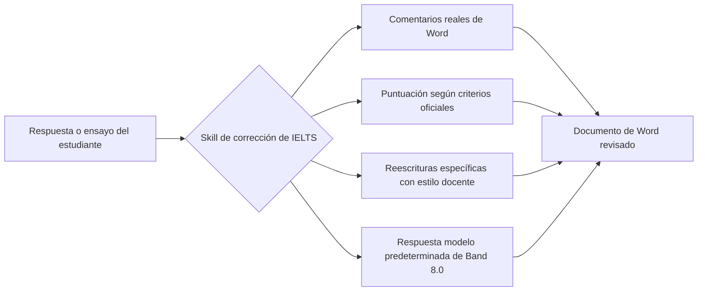

<div align="center">
  

  <h1>IELTS Writing Review Skills</h1>

  <p>
    Skills locales de corrección para IELTS Academic Writing Task 1 y Task 2, diseñadas para Codex y Claude Code.
    Admiten comentarios reales en DOCX, criterios oficiales de evaluación, retroalimentación con estilo docente, reescrituras específicas y generación de respuestas modelo.
  </p>

  <p>
    <a href="../README.md">简体中文</a>
    · <a href="./README.en.md">English</a>
    · <a href="./README.ja.md">日本語</a>
    · <a href="./README.ko.md">한국어</a>
    · <a href="./README.es.md"><strong>Español</strong></a>
    · <a href="./README.vi.md">Tiếng Việt</a>
    · <a href="./README.hi.md">हिन्दी</a>
    · <a href="./README.ar.md">العربية</a>
    · <a href="./README.fr.md">Français</a>
    · <a href="./README.bn.md">বাংলা</a>
    · <a href="./README.pt.md">Português</a>
    · <a href="./README.id.md">Bahasa Indonesia</a>
    · <a href="./README.ur.md">اردو</a>
    · <a href="./README.ru.md">Русский</a>
  </p>

  <p>
    <a href="https://github.com/AaronL725/ielts-writing-review-skills/stargazers"></a>
    <a href="../LICENSE"></a>
    
    
    
  </p>
</div>

## ¿Qué es este repositorio?

Este repositorio reúne dos skills de corrección para IELTS Writing. En lugar de limitarse a ofrecer consejos genéricos, permiten que un agente de IA complete un flujo de revisión similar al de un profesor real: identificar el enunciado y el texto original del estudiante, insertar comentarios reales de Word, evaluar la respuesta según los criterios oficiales, añadir reescrituras específicas por secciones y generar una respuesta modelo de alta calidad.

**Nivel objetivo predeterminado: reescrituras en cursiva estables de Band 7.5 y una respuesta modelo final estable de Band 8.0.** Si no indicas otra banda objetivo, ambas skills calibran las reescrituras locales en cursiva a un Band 7.5 consistente y la respuesta o el ensayo modelo final a un Band 8.0 consistente. También puedes incluir `Target band: 7.5`, `Target band: 8.0` u otro objetivo en el prompt para que el agente ajuste el enfoque de la retroalimentación.

| Skill | Escenarios recomendados | Salida predeterminada |
| --- | --- | --- |
| `$ielts-task1-review` | Gráficos, tablas, mapas, diagramas de procesos y elementos visuales mixtos de Academic Task 1 | DOCX revisado con comentarios de Word, puntuaciones, retroalimentación, reescrituras en cursiva estables de Band 7.5 y una respuesta modelo de cuatro párrafos de Band 8.0 |
| `$ielts-task2-review` | Ensayos de Task 2 de opinión, discusión, problema-solución, ventajas y desventajas, y tipos mixtos | DOCX revisado con comentarios de Word, puntuaciones, retroalimentación, reescrituras en cursiva estables de Band 7.5 y un ensayo modelo de cuatro párrafos de Band 8.0 |

## Requisitos de los archivos de entrada

Utiliza como entrada un archivo `.docx` **que no haya sido corregido previamente**. Los archivos revisados solo sirven como vista previa del resultado y no deben utilizarse para una nueva ronda de corrección.

| Tipo | Cómo organizar el documento de Word | Qué debes evitar |
| --- | --- | --- |
| Task 1 | Coloca primero el texto del enunciado; después, inserta el gráfico, mapa o diagrama de proceso como una imagen integrada en Word; coloca la respuesta del estudiante después de la imagen y sepárala en párrafos normales. | No coloques la respuesta antes de la imagen; no omitas el elemento visual; no incluyas puntuaciones, respuestas modelo ni comentarios antiguos en el archivo de entrada. |
| Task 2 | Coloca primero el enunciado completo; si hay un esquema, sitúalo después del enunciado y antes del ensayo formal; coloca el ensayo formal al final y sepáralo en párrafos normales. | No coloques el enunciado después del ensayo; no confundas el esquema con el ensayo formal; no incluyas retroalimentación antigua, respuestas modelo ni contenido ya revisado en el archivo de entrada. |

Estas posiciones son importantes porque la skill distingue primero el enunciado, las imágenes, el esquema y el texto principal del estudiante, y después ancla los comentarios de Word a los párrafos de la respuesta del estudiante.

## Archivos de ejemplo

El directorio `examples/` del repositorio contiene un conjunto de ejemplos de Task 1 y Task 2. Los archivos sin `(reviewed)` son ejemplos de entrada, mientras que los archivos con `(reviewed)` muestran el resultado de la corrección.

| Ejemplo | Archivo |
| --- | --- |
| Entrada de Task 1 | [C19T4 Writing Task 1.docx](<../examples/C19T4 Writing Task 1.docx>) |
| Salida revisada de Task 1 | [C19T4 Writing Task 1(reviewed).docx](<../examples/C19T4 Writing Task 1(reviewed).docx>) |
| Entrada de Task 2 | [C19T4 Writing Task 2.docx](<../examples/C19T4 Writing Task 2.docx>) |
| Salida revisada de Task 2 | [C19T4 Writing Task 2(reviewed).docx](<../examples/C19T4 Writing Task 2(reviewed).docx>) |

## Características principales

| Experiencia de corrección real | Conocimientos integrados de IELTS | Optimizado para agentes |
| --- | --- | --- |
| Inserta comentarios reales de Word, no anotaciones entre paréntesis en texto plano | Utiliza los descriptores oficiales de banda de IELTS para la evaluación | Funciona como skill local para Codex y Claude Code |
| Ancla los comentarios al texto original del estudiante, no al enunciado ni al esquema | Incluye reglas de estilo docente y referencias para extraer patrones de ejemplos | Incluye scripts de extracción, generación y validación de DOCX |
| Inserta una reescritura breve en cursiva después del texto original | Task 1 exige revisar primero el elemento visual; Task 2 exige revisar primero la respuesta a la tarea | Conserva el archivo original y crea una copia revisada independiente |
| Genera una página de puntuación, retroalimentación breve y una respuesta modelo | Las reescrituras en cursiva usan Band 7.5 por defecto; el modelo final usa Band 8.0 | Permite personalizar la banda objetivo desde el prompt |

## Flujo de corrección


```mermaid
flowchart LR
    A[Respuesta o ensayo del estudiante] --> B{Skill de corrección de IELTS}
    B --> C[Comentarios reales de Word]
    B --> D[Puntuación según criterios oficiales]
    B --> E[Reescrituras específicas con estilo docente]
    B --> F[Respuesta modelo predeterminada de Band 8.0]
    C --> G[Documento de Word revisado]
    D --> G
    E --> G
    F --> G
```

## Instalación

### Prompt de instalación para agentes de propósito general

```text
Install the IELTS Writing Review Skills from this GitHub repository: https://github.com/AaronL725/ielts-writing-review-skills and put the two skills into the correct local skills directory.
```

También puedes instalarlas manualmente.

Primero, clona el repositorio:

```bash
git clone https://github.com/AaronL725/ielts-writing-review-skills.git
cd ielts-writing-review-skills
```

### Codex

Instala ambas skills en el directorio de skills de Codex:

```bash
mkdir -p "${CODEX_HOME:-$HOME/.codex}/skills"
cp -R skills/ielts-task1-review skills/ielts-task2-review "${CODEX_HOME:-$HOME/.codex}/skills/"
```

### Claude Code

Instálalas como skills personales de Claude Code:

```bash
mkdir -p "$HOME/.claude/skills"
cp -R skills/ielts-task1-review skills/ielts-task2-review "$HOME/.claude/skills/"
```

Para utilizarlas solo en un proyecto concreto, cópialas en el directorio `.claude/skills` del proyecto:

```bash
mkdir -p .claude/skills
cp -R skills/ielts-task1-review skills/ielts-task2-review .claude/skills/
```

## Ejemplos de prompts

```text
Use $ielts-task1-review to review my IELTS Academic Writing Task 1 answer: [paste the path of your answer]
```

```text
Use $ielts-task2-review to review my IELTS Writing Task 2 essay: [paste the path of your essay]
```

```text
Use $ielts-task1-review to review my IELTS Academic Writing Task 1 answer. Target band: [your target band]. File: [paste the path of your answer]
```

```text
Use $ielts-task2-review to review my IELTS Writing Task 2 essay. Target band: [your target band]. File: [paste the path of your essay]
```

## ¿Qué incluye cada skill?

La skill de Task 1 incluye un flujo de análisis visual, los criterios oficiales de evaluación de Task 1, reglas de corrección con estilo docente, referencias para extraer patrones de ejemplos, ejemplos de gráficos, scripts de extracción de DOCX, scripts de generación de DOCX y scripts de validación.

La skill de Task 2 incluye la extracción del enunciado y del ensayo, los criterios oficiales de evaluación de Task 2, reglas de corrección con estilo docente, referencias para extraer patrones de ejemplos, lógica de correspondencia con ejemplos docentes, scripts de generación de DOCX y scripts de validación.

## Estructura del repositorio

```text
.
|-- assets/
|   `-- ielts-writing-review-skills-hero.png
|-- docs/
|   |-- README.ar.md
|   |-- README.bn.md
|   |-- README.en.md
|   |-- README.es.md
|   |-- README.fr.md
|   |-- README.hi.md
|   |-- README.id.md
|   |-- README.ja.md
|   |-- README.ko.md
|   |-- README.pt.md
|   |-- README.ru.md
|   |-- README.ur.md
|   `-- README.vi.md
|-- examples/
|   |-- C19T4 Writing Task 1.docx
|   |-- C19T4 Writing Task 1(reviewed).docx
|   |-- C19T4 Writing Task 2.docx
|   `-- C19T4 Writing Task 2(reviewed).docx
|-- skills/
|   |-- ielts-task1-review/
|   |   |-- SKILL.md
|   |   |-- agents/
|   |   |-- references/
|   |   `-- scripts/
|   `-- ielts-task2-review/
|       |-- SKILL.md
|       |-- agents/
|       |-- references/
|       `-- scripts/
|-- LICENSE
`-- README.md
```

## Compatibilidad

| Agente | Estado | Descripción |
| --- | --- | --- |
| Codex | Listo | Copia las skills a `$CODEX_HOME/skills`, normalmente `~/.codex/skills` |
| Claude Code | Listo | Copia las skills a `~/.claude/skills` o al directorio `.claude/skills` del proyecto |
| Otros agentes locales | Manual | Utiliza el prompt de instalación general y coloca ambas skills en el directorio local correspondiente del agente |

## ⭐️ Dale una estrella a este repositorio

Si este repositorio te ahorra tiempo al corregir IELTS Writing, darle una estrella puede ayudar a que más estudiantes y profesores lo descubran.