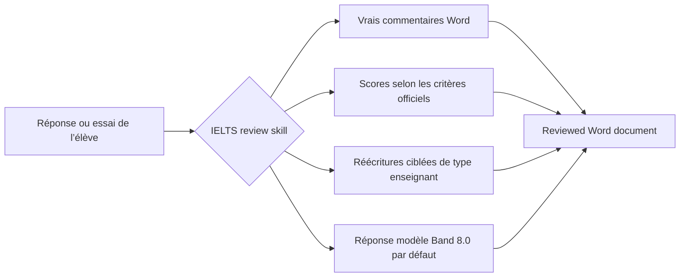

<div align="center">
  

  <h1>IELTS Writing Review Skills</h1>

  <p>
    Skills locales de correction pour IELTS Academic Writing Task 1 / Task 2, conçues pour Codex et Claude Code.
    Elles prennent en charge de vrais commentaires DOCX, les critères officiels d’évaluation, des retours de type enseignant, des réécritures ciblées et la génération de réponses modèles.
  </p>

  <p>
    <a href="../README.md">简体中文</a>
    · <a href="./README.en.md">English</a>
    · <a href="./README.ja.md">日本語</a>
    · <a href="./README.ko.md">한국어</a>
    · <a href="./README.es.md">Español</a>
    · <a href="./README.vi.md">Tiếng Việt</a>
    · <a href="./README.hi.md">हिन्दी</a>
    · <a href="./README.ar.md">العربية</a>
    · <a href="./README.fr.md"><strong>Français</strong></a>
    · <a href="./README.bn.md">বাংলা</a>
    · <a href="./README.pt.md">Português</a>
    · <a href="./README.id.md">Bahasa Indonesia</a>
    · <a href="./README.ur.md">اردو</a>
    · <a href="./README.ru.md">Русский</a>
  </p>

  <p>
    <a href="https://github.com/AaronL725/ielts-writing-review-skills/stargazers"></a>
    <a href="../LICENSE"></a>
    
    
    
  </p>
</div>

## Qu’est-ce que ce dépôt ?

Ce dépôt regroupe deux skills de correction IELTS Writing. L’objectif est de permettre à un agent d’IA d’aller au-delà de conseils génériques et d’exécuter un processus de correction complet, proche de celui d’un véritable enseignant : identifier le sujet et le texte original de l’élève, insérer de vrais commentaires Word, attribuer des scores selon les critères officiels, ajouter des réécritures ciblées et soignées, puis générer une réponse modèle de haute qualité adaptée au sujet.

**Niveau cible par défaut : réécritures en italique stables au Band 7.5 et réponse modèle finale stable au Band 8.0.** Si vous ne précisez pas d’autre niveau cible, les deux skills calibrent les réécritures locales en italique sur un Band 7.5 stable et le `model answer` / `model essay` final sur un Band 8.0 stable. Vous pouvez également écrire `Target band: 7.5`, `Target band: 8.0` ou un autre objectif dans le prompt afin que l’agent adapte l’orientation de ses retours.

| Skill | Cas d’usage adaptés | Sortie par défaut |
| --- | --- | --- |
| `$ielts-task1-review` | Graphiques, tableaux, cartes, diagrammes de processus et visuels mixtes d’Academic Task 1 | DOCX reviewed avec commentaires Word, scores, retours, réécritures en italique stables au Band 7.5 et réponse modèle Band 8.0 en 4 paragraphes |
| `$ielts-task2-review` | Essais Task 2 de type opinion, discussion, problème-solution, avantages/inconvénients et formats mixtes | DOCX reviewed avec commentaires Word, scores, retours, réécritures en italique stables au Band 7.5 et model essay Band 8.0 en 4 paragraphes |

## Exigences concernant le fichier d’entrée

Utilisez comme entrée **un fichier `.docx` qui n’a pas encore été corrigé**. Les fichiers reviewed servent uniquement à prévisualiser le résultat et ne doivent pas être réutilisés pour une nouvelle correction.

| Type | Organisation du document Word | À éviter |
| --- | --- | --- |
| Task 1 | Placez d’abord le texte du sujet ; insérez ensuite le graphique, la carte ou le diagramme de processus sous forme d’image intégrée dans Word ; placez la réponse de l’élève après l’image et séparez-la en paragraphes normaux | Ne placez pas la réponse avant l’image ; n’omettez pas le visuel ; n’intégrez pas d’anciens scores, réponses modèles ou commentaires dans le fichier d’entrée |
| Task 2 | Placez le sujet complet au début ; s’il existe un outline, placez-le après le sujet et avant l’essai final ; placez l’essai final en dernier et séparez-le en paragraphes normaux | Ne placez pas le sujet après l’essai ; ne traitez pas l’outline comme l’essai final ; n’ajoutez pas d’anciens retours, réponses modèles ou contenu reviewed au fichier d’entrée |

Cet ordre est important, car la skill distingue d’abord le sujet, les images, l’outline et le corps principal rédigé par l’élève, puis ancre les commentaires Word dans les paragraphes du texte de l’élève.

## Fichiers d’exemple

Le dossier `examples/` du dépôt contient un ensemble d’exemples Task 1 et Task 2. Les fichiers sans `(reviewed)` sont des exemples d’entrée ; ceux qui contiennent `(reviewed)` montrent le résultat après correction.

| Exemple | Fichier |
| --- | --- |
| Entrée Task 1 | [C19T4 Writing Task 1.docx](<../examples/C19T4 Writing Task 1.docx>) |
| Sortie reviewed Task 1 | [C19T4 Writing Task 1(reviewed).docx](<../examples/C19T4 Writing Task 1(reviewed).docx>) |
| Entrée Task 2 | [C19T4 Writing Task 2.docx](<../examples/C19T4 Writing Task 2.docx>) |
| Sortie reviewed Task 2 | [C19T4 Writing Task 2(reviewed).docx](<../examples/C19T4 Writing Task 2(reviewed).docx>) |

## Points forts

| Expérience de correction réaliste | Connaissances IELTS intégrées | Adapté aux agents |
| --- | --- | --- |
| Insère de vrais commentaires Word au lieu de simples remarques entre parenthèses | Utilise les IELTS band descriptors officiels pour l’évaluation | Peut être utilisé comme local skill avec Codex et Claude Code |
| Ancre les commentaires dans le texte original de l’élève, pas dans le sujet ni l’outline | Intègre des règles de correction de type enseignant et des références extraites d’exemples | Inclut des scripts d’extraction, de génération et de validation DOCX |
| Ajoute une brève italic rewrite après le texte original | Task 1 impose d’examiner d’abord le visuel ; Task 2 impose d’examiner d’abord la task response | Préserve le fichier original et produit une reviewed copy séparée |
| Génère une page de scores, un retour court et une réponse modèle | Les réécritures en italique sont par défaut au Band 7.5 et la réponse modèle finale au Band 8.0 | Permet de personnaliser le target band dans le prompt |

## Processus de correction



## Installation

### Prompt d’installation pour les agents généralistes

```text
Install the IELTS Writing Review Skills from this GitHub repository: https://github.com/AaronL725/ielts-writing-review-skills and put the two skills into the correct local skills directory.
```

Vous pouvez également les installer manuellement.

Commencez par cloner le dépôt :

```bash
git clone https://github.com/AaronL725/ielts-writing-review-skills.git
cd ielts-writing-review-skills
```

### Codex

Installez les deux skills dans le dossier skills de Codex :

```bash
mkdir -p "${CODEX_HOME:-$HOME/.codex}/skills"
cp -R skills/ielts-task1-review skills/ielts-task2-review "${CODEX_HOME:-$HOME/.codex}/skills/"
```

### Claude Code

Installez-les comme skills personnelles de Claude Code :

```bash
mkdir -p "$HOME/.claude/skills"
cp -R skills/ielts-task1-review skills/ielts-task2-review "$HOME/.claude/skills/"
```

Pour les utiliser uniquement dans un projet donné, copiez-les dans le dossier `.claude/skills` du projet :

```bash
mkdir -p .claude/skills
cp -R skills/ielts-task1-review skills/ielts-task2-review .claude/skills/
```

## Exemples de prompts

```text
Use $ielts-task1-review to review my IELTS Academic Writing Task 1 answer: [paste the path of your answer]
```

```text
Use $ielts-task2-review to review my IELTS Writing Task 2 essay: [paste the path of your essay]
```

```text
Use $ielts-task1-review to review my IELTS Academic Writing Task 1 answer. Target band: [your target band]. File: [paste the path of your answer]
```

```text
Use $ielts-task2-review to review my IELTS Writing Task 2 essay. Target band: [your target band]. File: [paste the path of your essay]
```

## Que contient chaque Skill ?

La skill Task 1 comprend un processus d’analyse visuelle, les critères officiels d’évaluation de Task 1, des règles de correction de type enseignant, des références d’extraction à partir d’exemples, des exemples de graphiques, des scripts d’extraction DOCX, des scripts de génération DOCX et des scripts de validation.

La skill Task 2 comprend l’extraction du sujet et de l’essai, les critères officiels d’évaluation de Task 2, des règles de correction de type enseignant, des références d’extraction à partir d’exemples, une logique de correspondance avec des exemples d’enseignants, des scripts de génération DOCX et des scripts de validation.

## Structure du dépôt

```text
.
|-- assets/
|   `-- ielts-writing-review-skills-hero.png
|-- docs/
|   |-- README.ar.md
|   |-- README.bn.md
|   |-- README.en.md
|   |-- README.es.md
|   |-- README.fr.md
|   |-- README.hi.md
|   |-- README.id.md
|   |-- README.ja.md
|   |-- README.ko.md
|   |-- README.pt.md
|   |-- README.ru.md
|   |-- README.ur.md
|   `-- README.vi.md
|-- examples/
|   |-- C19T4 Writing Task 1.docx
|   |-- C19T4 Writing Task 1(reviewed).docx
|   |-- C19T4 Writing Task 2.docx
|   `-- C19T4 Writing Task 2(reviewed).docx
|-- skills/
|   |-- ielts-task1-review/
|   |   |-- SKILL.md
|   |   |-- agents/
|   |   |-- references/
|   |   `-- scripts/
|   `-- ielts-task2-review/
|       |-- SKILL.md
|       |-- agents/
|       |-- references/
|       `-- scripts/
|-- LICENSE
`-- README.md
```

## Compatibilité

| Agent | Statut | Description |
| --- | --- | --- |
| Codex | Ready | Copiez les skills dans `$CODEX_HOME/skills`, généralement `~/.codex/skills` |
| Claude Code | Ready | Copiez-les dans `~/.claude/skills` ou dans `.claude/skills` au niveau du projet |
| Autres agents locaux | Manual | Utilisez le prompt d’installation général et placez les deux skills dans le dossier local skills approprié de l’agent |

## ⭐️ Ajoutez une Star à ce dépôt

Si ce dépôt vous fait gagner du temps pour corriger IELTS Writing, lui donner une star peut aider davantage d’apprenants et d’enseignants à le découvrir.