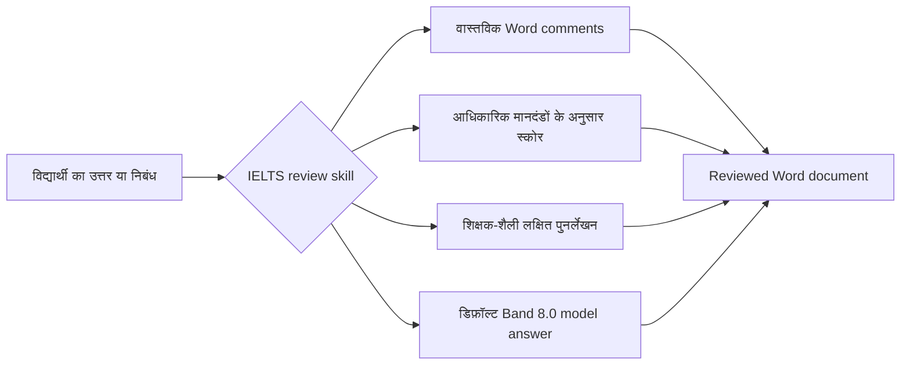

<div align="center">
  

  <h1>IELTS Writing Review Skills</h1>

  <p>
    Codex और Claude Code के लिए बनाए गए IELTS Academic Writing Task 1 / Task 2 के स्थानीय समीक्षा कौशल।
    ये DOCX में वास्तविक टिप्पणियाँ, आधिकारिक मूल्यांकन मानदंड, शिक्षक-शैली प्रतिक्रिया, लक्षित पुनर्लेखन और मॉडल उत्तर तैयार करने का समर्थन करते हैं।
  </p>

  <p>
    <a href="../README.md">简体中文</a>
    · <a href="./README.en.md">English</a>
    · <a href="./README.ja.md">日本語</a>
    · <a href="./README.ko.md">한국어</a>
    · <a href="./README.es.md">Español</a>
    · <a href="./README.vi.md">Tiếng Việt</a>
    · <a href="./README.hi.md"><strong>हिन्दी</strong></a>
    · <a href="./README.ar.md">العربية</a>
    · <a href="./README.fr.md">Français</a>
    · <a href="./README.bn.md">বাংলা</a>
    · <a href="./README.pt.md">Português</a>
    · <a href="./README.id.md">Bahasa Indonesia</a>
    · <a href="./README.ur.md">اردو</a>
    · <a href="./README.ru.md">Русский</a>
  </p>

  <p>
    <a href="https://github.com/AaronL725/ielts-writing-review-skills/stargazers"></a>
    <a href="../LICENSE"></a>
    
    
    
  </p>
</div>

## यह रिपॉज़िटरी क्या है?

यह रिपॉज़िटरी IELTS Writing की समीक्षा के लिए दो skills को पैकेज करती है। इसका उद्देश्य AI agent को केवल सामान्य सुझाव देने तक सीमित न रखकर, वास्तविक शिक्षक के कामकाज के करीब एक पूरा समीक्षा-प्रवाह पूरा करने देना है: प्रश्न और विद्यार्थी के मूल लेखन की पहचान करना, Word में वास्तविक comments जोड़ना, आधिकारिक मानदंडों के अनुसार स्कोर देना, चुने हुए हिस्सों के बेहतर पुनर्लेखन जोड़ना और उससे मेल खाता उच्च-गुणवत्ता वाला मॉडल उत्तर तैयार करना।

**डिफ़ॉल्ट लक्ष्य स्तर: italic rewrites स्थिर Band 7.5 पर और अंतिम model answer स्थिर Band 8.0 पर।** यदि आप अलग लक्ष्य band नहीं बताते, तो दोनों skills स्थानीय italic rewrites को स्थिर Band 7.5 और अंतिम model answer / model essay को स्थिर Band 8.0 पर कैलिब्रेट करते हैं। आप prompt में `Target band: 7.5`, `Target band: 8.0` या कोई अन्य लक्ष्य लिख सकते हैं, ताकि agent उसी के अनुसार feedback का फोकस समायोजित करे।

| Skill | उपयुक्त उपयोग | डिफ़ॉल्ट आउटपुट |
| --- | --- | --- |
| `$ielts-task1-review` | Academic Task 1 के चार्ट, टेबल, मैप, प्रोसेस डायग्राम और मिश्रित visuals | Word comments, स्कोर, feedback, स्थिर Band 7.5 italic rewrites और 4-पैराग्राफ Band 8.0 model answer वाला reviewed DOCX |
| `$ielts-task2-review` | Task 2 के opinion, discussion, problem-solution, advantages/disadvantages और mixed essay प्रकार | Word comments, स्कोर, feedback, स्थिर Band 7.5 italic rewrites और 4-पैराग्राफ Band 8.0 model essay वाला reviewed DOCX |

## इनपुट फ़ाइल की आवश्यकताएँ

इनपुट के रूप में **ऐसी `.docx` फ़ाइल इस्तेमाल करें जिसकी पहले समीक्षा न हुई हो**। Reviewed फ़ाइलें केवल परिणाम का preview देखने के लिए हैं; उन्हें दोबारा review के इनपुट के रूप में न दें।

| प्रकार | Word दस्तावेज़ में कैसे रखें | क्या न करें |
| --- | --- | --- |
| Task 1 | प्रश्न का टेक्स्ट सबसे पहले रखें; उसके बाद चार्ट/मैप/प्रोसेस डायग्राम को Word में embedded image के रूप में रखें; विद्यार्थी का उत्तर image के बाद सामान्य पैराग्राफ में रखें | विद्यार्थी का उत्तर image से पहले न रखें; visual को न छोड़ें; पुराने स्कोर, model answer या comments इनपुट फ़ाइल में न मिलाएँ |
| Task 2 | पूरा प्रश्न सबसे पहले रखें; यदि outline है, तो उसे प्रश्न के बाद और औपचारिक essay से पहले रखें; औपचारिक essay सबसे अंत में सामान्य पैराग्राफ में रखें | प्रश्न को essay के बाद न रखें; outline को औपचारिक essay न मानें; पुराने feedback, model answers या reviewed सामग्री इनपुट फ़ाइल में न रखें |

इन हिस्सों का स्थान महत्वपूर्ण है, क्योंकि skill पहले प्रश्न, images, outline और विद्यार्थी के मुख्य लेखन को अलग पहचानता है, फिर Word comments को विद्यार्थी के लेखन वाले पैराग्राफ से जोड़ता है।

## उदाहरण फ़ाइलें

रिपॉज़िटरी की `examples/` डायरेक्टरी में Task 1 और Task 2 के उदाहरणों का एक सेट है। जिन फ़ाइलों के नाम में `(reviewed)` नहीं है वे input examples हैं, और जिनमें `(reviewed)` है वे review के बाद के output previews हैं।

| उदाहरण | फ़ाइल |
| --- | --- |
| Task 1 input | [C19T4 Writing Task 1.docx](<../examples/C19T4 Writing Task 1.docx>) |
| Task 1 reviewed output | [C19T4 Writing Task 1(reviewed).docx](<../examples/C19T4 Writing Task 1(reviewed).docx>) |
| Task 2 input | [C19T4 Writing Task 2.docx](<../examples/C19T4 Writing Task 2.docx>) |
| Task 2 reviewed output | [C19T4 Writing Task 2(reviewed).docx](<../examples/C19T4 Writing Task 2(reviewed).docx>) |

## मुख्य विशेषताएँ

| वास्तविक review अनुभव | अंतर्निहित IELTS ज्ञान | Agent के अनुकूल |
| --- | --- | --- |
| सादा टेक्स्ट में कोष्ठक वाली टिप्पणियों के बजाय वास्तविक Word comments जोड़ता है | आधिकारिक IELTS band descriptors से स्कोर करता है | Codex और Claude Code में local skill के रूप में इस्तेमाल किया जा सकता है |
| comments को प्रश्न या outline की बजाय विद्यार्थी के मूल लेखन से जोड़ता है | शिक्षक-शैली नियम और sample-extraction references शामिल हैं | DOCX extraction, generation और validation scripts शामिल हैं |
| मूल टेक्स्ट के बाद संक्षिप्त italic rewrite जोड़ता है | Task 1 में पहले visual देखना अनिवार्य है; Task 2 में पहले task response देखना अनिवार्य है | मूल फ़ाइल को सुरक्षित रखता है और अलग reviewed copy बनाता है |
| score page, संक्षिप्त feedback और model answer बनाता है | italic rewrites डिफ़ॉल्ट Band 7.5 और अंतिम model answer Band 8.0 पर | prompt से target band बदला जा सकता है |

## समीक्षा प्रक्रिया



## इंस्टॉलेशन

### सामान्य agents के लिए इंस्टॉलेशन prompt

```text
Install the IELTS Writing Review Skills from this GitHub repository: https://github.com/AaronL725/ielts-writing-review-skills and put the two skills into the correct local skills directory.
```

आप इन्हें मैन्युअल रूप से भी इंस्टॉल कर सकते हैं।

पहले रिपॉज़िटरी clone करें:

```bash
git clone https://github.com/AaronL725/ielts-writing-review-skills.git
cd ielts-writing-review-skills
```

### Codex

दोनों skills को Codex skills डायरेक्टरी में इंस्टॉल करें:

```bash
mkdir -p "${CODEX_HOME:-$HOME/.codex}/skills"
cp -R skills/ielts-task1-review skills/ielts-task2-review "${CODEX_HOME:-$HOME/.codex}/skills/"
```

### Claude Code

इन्हें Claude Code की personal skills के रूप में इंस्टॉल करें:

```bash
mkdir -p "$HOME/.claude/skills"
cp -R skills/ielts-task1-review skills/ielts-task2-review "$HOME/.claude/skills/"
```

यदि केवल किसी एक प्रोजेक्ट में इस्तेमाल करना हो, तो इन्हें प्रोजेक्ट-स्तरीय `.claude/skills` में कॉपी करें:

```bash
mkdir -p .claude/skills
cp -R skills/ielts-task1-review skills/ielts-task2-review .claude/skills/
```

## Prompt उदाहरण

```text
Use $ielts-task1-review to review my IELTS Academic Writing Task 1 answer: [paste the path of your answer]
```

```text
Use $ielts-task2-review to review my IELTS Writing Task 2 essay: [paste the path of your essay]
```

```text
Use $ielts-task1-review to review my IELTS Academic Writing Task 1 answer. Target band: [your target band]. File: [paste the path of your answer]
```

```text
Use $ielts-task2-review to review my IELTS Writing Task 2 essay. Target band: [your target band]. File: [paste the path of your essay]
```

## प्रत्येक Skill में क्या शामिल है?

Task 1 skill में visual-analysis workflow, Task 1 के आधिकारिक scoring criteria, teacher-style review rules, sample-extraction references, chart samples, DOCX extraction scripts, DOCX generation scripts और validation scripts शामिल हैं।

Task 2 skill में task और essay extraction, Task 2 के आधिकारिक scoring criteria, teacher-style review rules, sample-extraction references, teacher-sample matching logic, DOCX generation scripts और validation scripts शामिल हैं।

## रिपॉज़िटरी संरचना

```text
.
|-- assets/
|   `-- ielts-writing-review-skills-hero.png
|-- docs/
|   |-- README.ar.md
|   |-- README.bn.md
|   |-- README.en.md
|   |-- README.es.md
|   |-- README.fr.md
|   |-- README.hi.md
|   |-- README.id.md
|   |-- README.ja.md
|   |-- README.ko.md
|   |-- README.pt.md
|   |-- README.ru.md
|   |-- README.ur.md
|   `-- README.vi.md
|-- examples/
|   |-- C19T4 Writing Task 1.docx
|   |-- C19T4 Writing Task 1(reviewed).docx
|   |-- C19T4 Writing Task 2.docx
|   `-- C19T4 Writing Task 2(reviewed).docx
|-- skills/
|   |-- ielts-task1-review/
|   |   |-- SKILL.md
|   |   |-- agents/
|   |   |-- references/
|   |   `-- scripts/
|   `-- ielts-task2-review/
|       |-- SKILL.md
|       |-- agents/
|       |-- references/
|       `-- scripts/
|-- LICENSE
`-- README.md
```

## संगतता

| Agent | स्थिति | विवरण |
| --- | --- | --- |
| Codex | Ready | `$CODEX_HOME/skills` में कॉपी करें, जो आमतौर पर `~/.codex/skills` होता है |
| Claude Code | Ready | `~/.claude/skills` या प्रोजेक्ट की `.claude/skills` डायरेक्टरी में कॉपी करें |
| अन्य local agents | Manual | सामान्य installation prompt का उपयोग करें और दोनों skills को संबंधित agent की local skills डायरेक्टरी में रखें |

## ⭐️ इस रिपॉज़िटरी को Star दें

यदि यह रिपॉज़िटरी IELTS Writing की समीक्षा में आपका समय बचाती है, तो एक star अधिक विद्यार्थियों और शिक्षकों को इसे खोजने में मदद कर सकता है।