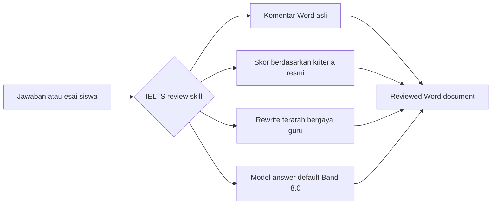

<div align="center">
  

  <h1>IELTS Writing Review Skills</h1>

  <p>
    Skill review lokal untuk IELTS Academic Writing Task 1 / Task 2 yang dirancang untuk Codex dan Claude Code.
    Mendukung komentar DOCX asli, kriteria penilaian resmi, feedback bergaya guru, rewrite terarah, dan pembuatan model answer.
  </p>

  <p>
    <a href="../README.md">简体中文</a>
    · <a href="./README.en.md">English</a>
    · <a href="./README.ja.md">日本語</a>
    · <a href="./README.ko.md">한국어</a>
    · <a href="./README.es.md">Español</a>
    · <a href="./README.vi.md">Tiếng Việt</a>
    · <a href="./README.hi.md">हिन्दी</a>
    · <a href="./README.ar.md">العربية</a>
    · <a href="./README.fr.md">Français</a>
    · <a href="./README.bn.md">বাংলা</a>
    · <a href="./README.pt.md">Português</a>
    · <a href="./README.id.md"><strong>Bahasa Indonesia</strong></a>
    · <a href="./README.ur.md">اردو</a>
    · <a href="./README.ru.md">Русский</a>
  </p>

  <p>
    <a href="https://github.com/AaronL725/ielts-writing-review-skills/stargazers"></a>
    <a href="../LICENSE"></a>
    
    
    
  </p>
</div>

## Apa isi repositori ini?

Repositori ini mengemas dua skill untuk mereview IELTS Writing. Tujuannya agar AI agent tidak hanya memberikan saran umum, tetapi dapat menjalankan alur review lengkap yang mendekati cara kerja guru sungguhan: mengenali soal dan tulisan asli siswa, menyisipkan komentar Word asli, memberikan skor berdasarkan kriteria resmi, menambahkan rewrite terarah pada bagian tertentu, lalu menghasilkan model answer berkualitas tinggi yang sesuai.

**Target default: italic rewrite stabil pada Band 7.5 dan model answer akhir stabil pada Band 8.0.** Jika Anda tidak menentukan target band lain, kedua skill akan mengkalibrasi italic rewrite lokal ke Band 7.5 yang stabil dan `model answer` / `model essay` akhir ke Band 8.0 yang stabil. Anda juga dapat menulis `Target band: 7.5`, `Target band: 8.0`, atau target lain di prompt agar agent menyesuaikan fokus feedback sesuai target Anda.

| Skill | Cocok untuk | Output default |
| --- | --- | --- |
| `$ielts-task1-review` | Chart, tabel, peta, process diagram, dan visual campuran pada Academic Task 1 | Reviewed DOCX berisi komentar Word, skor, feedback, italic rewrite Band 7.5 yang stabil, dan model answer Band 8.0 sebanyak 4 paragraf |
| `$ielts-task2-review` | Esai Task 2 tipe opinion, discussion, problem-solution, advantages/disadvantages, dan tipe campuran | Reviewed DOCX berisi komentar Word, skor, feedback, italic rewrite Band 7.5 yang stabil, dan model essay Band 8.0 sebanyak 4 paragraf |

## Persyaratan file input

Gunakan **file `.docx` yang belum pernah direview** sebagai input. File reviewed hanya untuk melihat preview hasil dan tidak boleh digunakan lagi sebagai input review berikutnya.

| Jenis | Cara menyusun dokumen Word | Yang harus dihindari |
| --- | --- | --- |
| Task 1 | Letakkan teks soal di bagian paling awal; tempatkan chart/peta/process diagram sebagai gambar yang tertanam di Word setelah soal; letakkan jawaban siswa setelah gambar dan pisahkan menjadi paragraf normal | Jangan letakkan jawaban siswa sebelum gambar; jangan hilangkan visual; jangan mencampurkan skor lama, model answer, atau komentar lama ke file input |
| Task 2 | Letakkan soal lengkap di bagian paling awal; jika ada outline, letakkan setelah soal dan sebelum esai formal; letakkan esai formal paling akhir dan pisahkan menjadi paragraf normal | Jangan letakkan soal setelah esai; jangan anggap outline sebagai esai formal; jangan masukkan feedback lama, model answer, atau konten reviewed ke file input |

Posisi ini penting karena skill terlebih dahulu membedakan soal, gambar, outline, dan tulisan utama siswa, lalu menautkan komentar Word ke paragraf tulisan siswa.

## File contoh

Direktori `examples/` berisi satu set contoh Task 1 dan Task 2. File tanpa `(reviewed)` adalah contoh input, sedangkan file dengan `(reviewed)` menunjukkan preview output setelah review.

| Contoh | File |
| --- | --- |
| Input Task 1 | [C19T4 Writing Task 1.docx](<../examples/C19T4 Writing Task 1.docx>) |
| Output reviewed Task 1 | [C19T4 Writing Task 1(reviewed).docx](<../examples/C19T4 Writing Task 1(reviewed).docx>) |
| Input Task 2 | [C19T4 Writing Task 2.docx](<../examples/C19T4 Writing Task 2.docx>) |
| Output reviewed Task 2 | [C19T4 Writing Task 2(reviewed).docx](<../examples/C19T4 Writing Task 2(reviewed).docx>) |

## Fitur utama

| Pengalaman review yang nyata | Pengetahuan IELTS bawaan | Ramah untuk Agent |
| --- | --- | --- |
| Menyisipkan komentar Word asli, bukan catatan teks biasa dalam tanda kurung | Menggunakan IELTS band descriptors resmi untuk penilaian | Dapat digunakan sebagai local skill di Codex dan Claude Code |
| Menautkan komentar ke tulisan asli siswa, bukan ke soal atau outline | Memuat aturan bergaya guru dan referensi yang diringkas dari contoh | Memuat script untuk ekstraksi, pembuatan, dan validasi DOCX |
| Menyisipkan italic rewrite singkat setelah teks asli | Task 1 wajib memeriksa visual terlebih dahulu; Task 2 wajib memeriksa task response terlebih dahulu | Mempertahankan file asli dan menghasilkan reviewed copy terpisah |
| Menghasilkan halaman skor, feedback singkat, dan model answer | Italic rewrite default Band 7.5, model answer akhir default Band 8.0 | Target band dapat dikustomisasi melalui prompt |

## Alur review



## Instalasi

### Prompt instalasi untuk agent umum

```text
Install the IELTS Writing Review Skills from this GitHub repository: https://github.com/AaronL725/ielts-writing-review-skills and put the two skills into the correct local skills directory.
```

Anda juga dapat menginstalnya secara manual.

Clone repositori terlebih dahulu:

```bash
git clone https://github.com/AaronL725/ielts-writing-review-skills.git
cd ielts-writing-review-skills
```

### Codex

Instal kedua skill ke direktori skills Codex:

```bash
mkdir -p "${CODEX_HOME:-$HOME/.codex}/skills"
cp -R skills/ielts-task1-review skills/ielts-task2-review "${CODEX_HOME:-$HOME/.codex}/skills/"
```

### Claude Code

Instal sebagai personal skills Claude Code:

```bash
mkdir -p "$HOME/.claude/skills"
cp -R skills/ielts-task1-review skills/ielts-task2-review "$HOME/.claude/skills/"
```

Jika hanya ingin menggunakannya dalam satu proyek, salin ke `.claude/skills` di tingkat proyek:

```bash
mkdir -p .claude/skills
cp -R skills/ielts-task1-review skills/ielts-task2-review .claude/skills/
```

## Contoh Prompt

```text
Use $ielts-task1-review to review my IELTS Academic Writing Task 1 answer: [paste the path of your answer]
```

```text
Use $ielts-task2-review to review my IELTS Writing Task 2 essay: [paste the path of your essay]
```

```text
Use $ielts-task1-review to review my IELTS Academic Writing Task 1 answer. Target band: [your target band]. File: [paste the path of your answer]
```

```text
Use $ielts-task2-review to review my IELTS Writing Task 2 essay. Target band: [your target band]. File: [paste the path of your essay]
```

## Apa saja isi setiap Skill?

Skill Task 1 mencakup alur analisis visual, kriteria penilaian resmi Task 1, aturan review bergaya guru, referensi ekstraksi dari contoh, contoh chart, script ekstraksi DOCX, script pembuatan DOCX, dan script validasi.

Skill Task 2 mencakup ekstraksi soal dan esai, kriteria penilaian resmi Task 2, aturan review bergaya guru, referensi ekstraksi dari contoh, logika pencocokan contoh guru, script pembuatan DOCX, dan script validasi.

## Struktur repositori

```text
.
|-- assets/
|   `-- ielts-writing-review-skills-hero.png
|-- docs/
|   |-- README.ar.md
|   |-- README.bn.md
|   |-- README.en.md
|   |-- README.es.md
|   |-- README.fr.md
|   |-- README.hi.md
|   |-- README.id.md
|   |-- README.ja.md
|   |-- README.ko.md
|   |-- README.pt.md
|   |-- README.ru.md
|   |-- README.ur.md
|   `-- README.vi.md
|-- examples/
|   |-- C19T4 Writing Task 1.docx
|   |-- C19T4 Writing Task 1(reviewed).docx
|   |-- C19T4 Writing Task 2.docx
|   `-- C19T4 Writing Task 2(reviewed).docx
|-- skills/
|   |-- ielts-task1-review/
|   |   |-- SKILL.md
|   |   |-- agents/
|   |   |-- references/
|   |   `-- scripts/
|   `-- ielts-task2-review/
|       |-- SKILL.md
|       |-- agents/
|       |-- references/
|       `-- scripts/
|-- LICENSE
`-- README.md
```

## Kompatibilitas

| Agent | Status | Keterangan |
| --- | --- | --- |
| Codex | Ready | Salin ke `$CODEX_HOME/skills`, biasanya `~/.codex/skills` |
| Claude Code | Ready | Salin ke `~/.claude/skills` atau `.claude/skills` milik proyek |
| Agent lokal lainnya | Manual | Gunakan prompt instalasi umum dan tempatkan kedua skill di direktori local skills yang sesuai untuk agent tersebut |

## ⭐️ Beri Star untuk repositori ini

Jika repositori ini menghemat waktu Anda saat mereview IELTS Writing, memberikan star dapat membantu lebih banyak pelajar dan guru menemukannya.