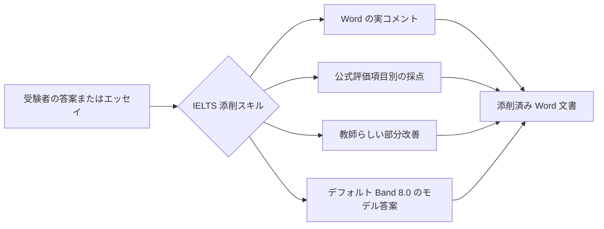

<div align="center">
  

  <h1>IELTS Writing Review Skills</h1>

  <p>
    Codex と Claude Code 向けに設計された、IELTS Academic Writing Task 1 / Task 2 のローカル添削スキルです。
    DOCX への実際のコメント挿入、公式評価基準による採点、教師らしいフィードバック、部分的な改善例、モデル答案の生成に対応します。
  </p>

  <p>
    <a href="../README.md">简体中文</a>
    · <a href="./README.en.md">English</a>
    · <a href="./README.ja.md"><strong>日本語</strong></a>
    · <a href="./README.ko.md">한국어</a>
    · <a href="./README.es.md">Español</a>
  </p>

  <p>
    <a href="https://github.com/AaronL725/ielts-writing-review-skills/stargazers"></a>
    <a href="../LICENSE"></a>
    
    
    
  </p>
</div>

## このリポジトリについて

このリポジトリには、IELTS Writing を添削するための 2 つのスキルがまとめられています。AI エージェントが一般的な助言を返すだけでなく、実際の教師に近い一連の添削作業を行えるように設計されています。具体的には、問題文と受験者の原文を識別し、Word に実際のコメントを挿入し、公式評価基準に沿って採点し、各部分の的確な改善例を追加し、対応する高品質なモデル答案を生成します。

**デフォルトの目標レベルは、斜体の部分改善が安定した Band 7.5、最後のモデル答案が安定した Band 8.0 です。** 別の目標バンドを指定しない場合、両スキルは部分的な斜体の改善例を安定した Band 7.5 に、最後の model answer / model essay を安定した Band 8.0 に調整します。プロンプトに `Target band: 7.5`、`Target band: 8.0` などと書けば、目標に応じてフィードバックの重点を変更できます。

| Skill | 推奨される用途 | デフォルト出力 |
| --- | --- | --- |
| `$ielts-task1-review` | Academic Task 1 のグラフ、表、地図、プロセス図、複合図表 | Word コメント、採点、フィードバック、安定した Band 7.5 の斜体改善例、4 段落の Band 8.0 モデル答案を含む reviewed DOCX |
| `$ielts-task2-review` | Task 2 の意見型、両論型、問題解決型、長所・短所型、複合型エッセイ | Word コメント、採点、フィードバック、安定した Band 7.5 の斜体改善例、4 段落の Band 8.0 モデルエッセイを含む reviewed DOCX |

## 入力ファイルの要件

入力には、**まだ添削されていない `.docx` ファイル**を使用してください。Reviewed ファイルは出力例の確認用であり、再度の添削には使用しないでください。

| 種類 | Word 文書内での配置 | 避けること |
| --- | --- | --- |
| Task 1 | 最初に問題文を置き、その後にグラフ、地図、プロセス図を Word の埋め込み画像として配置します。受験者の答案は画像の後に置き、通常の段落に分けます。 | 答案を画像より前に置かないでください。図表を省略しないでください。過去の採点、モデル答案、コメントを入力ファイルに含めないでください。 |
| Task 2 | 最初に完全な問題文を置きます。アウトラインがある場合は、問題文の後、正式なエッセイの前に配置します。正式なエッセイは最後に置き、通常の段落に分けます。 | 問題文をエッセイの後に置かないでください。アウトラインを正式なエッセイとして扱わないでください。過去のフィードバック、モデル答案、添削済みの内容を入力ファイルに含めないでください。 |

これらの配置は重要です。スキルは最初に問題文、画像、アウトライン、受験者の本文を区別し、その後、受験者の本文の段落に Word コメントを紐付けます。

## サンプルファイル

リポジトリの `examples/` ディレクトリには、Task 1 と Task 2 のサンプル一式が含まれています。ファイル名に `(reviewed)` がないものは入力例、`(reviewed)` があるものは添削後の出力例です。

| サンプル | ファイル |
| --- | --- |
| Task 1 入力 | [C19T4 Writing Task 1.docx](<../examples/C19T4 Writing Task 1.docx>) |
| Task 1 添削済み出力 | [C19T4 Writing Task 1(reviewed).docx](<../examples/C19T4 Writing Task 1(reviewed).docx>) |
| Task 2 入力 | [C19T4 Writing Task 2.docx](<../examples/C19T4 Writing Task 2.docx>) |
| Task 2 添削済み出力 | [C19T4 Writing Task 2(reviewed).docx](<../examples/C19T4 Writing Task 2(reviewed).docx>) |

## 主な特長

| 実践的な添削体験 | IELTS の知識を内蔵 | エージェント向けの設計 |
| --- | --- | --- |
| プレーンテキストの括弧書きではなく、Word の実際のコメントを挿入 | IELTS の公式 band descriptors を使って採点 | Codex と Claude Code のローカルスキルとして利用可能 |
| 問題文やアウトラインではなく、受験者の原文にコメントを紐付け | 教師らしい添削ルールとサンプル抽出用の参考資料を内蔵 | DOCX の抽出、生成、検証用スクリプトを同梱 |
| 原文の後に簡潔な斜体の改善例を挿入 | Task 1 では図表分析を、Task 2 では設問への応答を優先 | 元ファイルを保持し、別の reviewed copy を生成 |
| 採点ページ、短いフィードバック、モデル答案を生成 | 斜体の改善例はデフォルトで Band 7.5、最後のモデル答案は Band 8.0 | プロンプトから目標バンドを指定可能 |

## 添削フロー



## インストール

### 汎用エージェント向けインストールプロンプト

```text
Install the IELTS Writing Review Skills from this GitHub repository: https://github.com/AaronL725/ielts-writing-review-skills and put the two skills into the correct local skills directory.
```

手動でインストールすることもできます。

まずリポジトリをクローンします。

```bash
git clone https://github.com/AaronL725/ielts-writing-review-skills.git
cd ielts-writing-review-skills
```

### Codex

2 つのスキルを Codex の skills ディレクトリにインストールします。

```bash
mkdir -p "${CODEX_HOME:-$HOME/.codex}/skills"
cp -R skills/ielts-task1-review skills/ielts-task2-review "${CODEX_HOME:-$HOME/.codex}/skills/"
```

### Claude Code

Claude Code の個人用スキルとしてインストールします。

```bash
mkdir -p "$HOME/.claude/skills"
cp -R skills/ielts-task1-review skills/ielts-task2-review "$HOME/.claude/skills/"
```

特定のプロジェクトだけで使用する場合は、プロジェクト直下の `.claude/skills` ディレクトリにコピーします。

```bash
mkdir -p .claude/skills
cp -R skills/ielts-task1-review skills/ielts-task2-review .claude/skills/
```

## プロンプト例

```text
Use $ielts-task1-review to review my IELTS Academic Writing Task 1 answer: [paste the path of your answer]
```

```text
Use $ielts-task2-review to review my IELTS Writing Task 2 essay: [paste the path of your essay]
```

```text
Use $ielts-task1-review to review my IELTS Academic Writing Task 1 answer. Target band: [your target band]. File: [paste the path of your answer]
```

```text
Use $ielts-task2-review to review my IELTS Writing Task 2 essay. Target band: [your target band]. File: [paste the path of your essay]
```

## 各 Skill に含まれるもの

Task 1 スキルには、図表分析のワークフロー、Task 1 の公式評価基準、教師らしい添削ルール、サンプル抽出用の参考資料、図表サンプル、DOCX 抽出スクリプト、DOCX 生成スクリプト、検証スクリプトが含まれます。

Task 2 スキルには、問題文とエッセイの抽出、Task 2 の公式評価基準、教師らしい添削ルール、サンプル抽出用の参考資料、教師サンプルとの照合ロジック、DOCX 生成スクリプト、検証スクリプトが含まれます。

## リポジトリ構成

```text
.
|-- assets/
|   `-- ielts-writing-review-skills-hero.png
|-- docs/
|   |-- README.en.md
|   |-- README.es.md
|   |-- README.ja.md
|   `-- README.ko.md
|-- examples/
|   |-- C19T4 Writing Task 1.docx
|   |-- C19T4 Writing Task 1(reviewed).docx
|   |-- C19T4 Writing Task 2.docx
|   `-- C19T4 Writing Task 2(reviewed).docx
|-- skills/
|   |-- ielts-task1-review/
|   |   |-- SKILL.md
|   |   |-- agents/
|   |   |-- references/
|   |   `-- scripts/
|   `-- ielts-task2-review/
|       |-- SKILL.md
|       |-- agents/
|       |-- references/
|       `-- scripts/
|-- LICENSE
`-- README.md
```

## 互換性

| エージェント | 状態 | 説明 |
| --- | --- | --- |
| Codex | 対応済み | `$CODEX_HOME/skills`（通常は `~/.codex/skills`）にコピー |
| Claude Code | 対応済み | `~/.claude/skills` またはプロジェクトの `.claude/skills` にコピー |
| その他のローカルエージェント | 手動 | 汎用インストールプロンプトを使い、2 つのスキルを各エージェントのローカル skills ディレクトリに配置 |

## ⭐️ このリポジトリに Star を付ける

このリポジトリによって IELTS Writing の添削時間を短縮できた場合は、Star を付けていただくことで、より多くの学習者や教師に見つけてもらいやすくなります。
