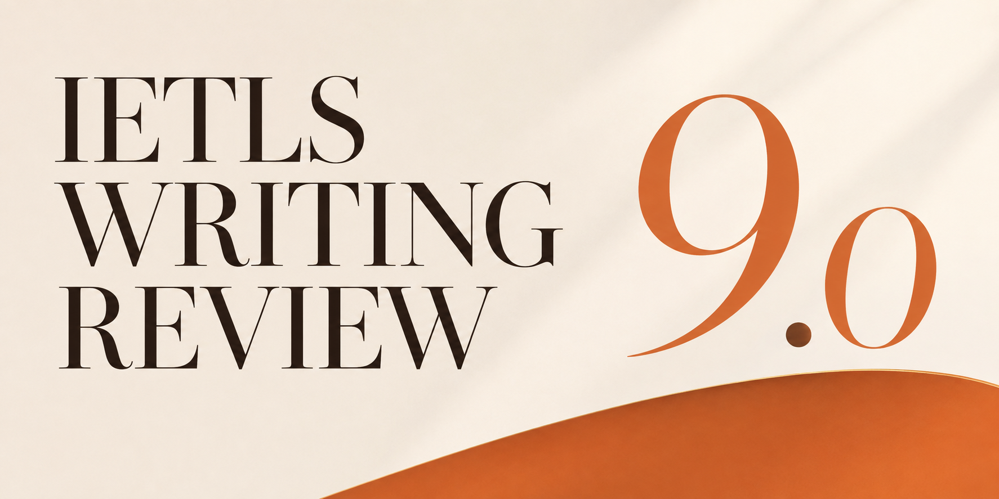
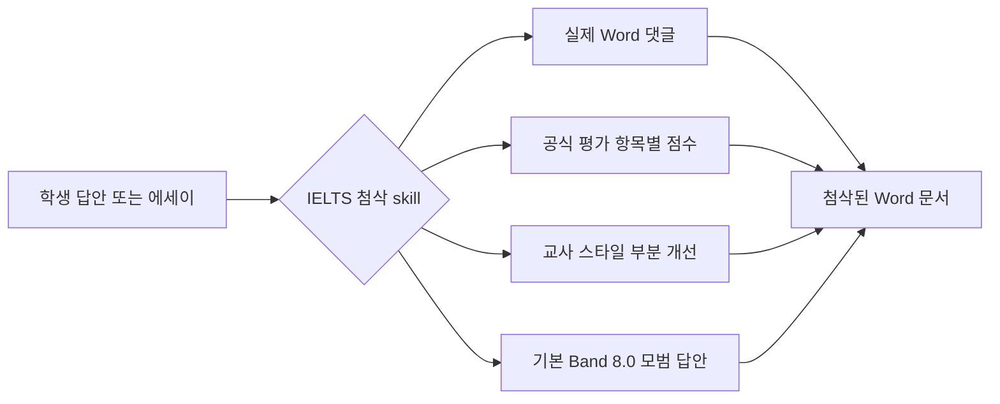

<div align="center">
  

  <h1>IELTS Writing Review Skills</h1>

  <p>
    Codex와 Claude Code를 위해 설계된 IELTS Academic Writing Task 1 / Task 2 로컬 첨삭 skill입니다.
    DOCX의 실제 댓글, 공식 평가 기준에 따른 채점, 교사 스타일 피드백, 부분별 개선문, 모범 답안 생성을 지원합니다.
  </p>

  <p>
    <a href="../README.md">简体中文</a>
    · <a href="./README.en.md">English</a>
    · <a href="./README.ja.md">日本語</a>
    · <a href="./README.ko.md"><strong>한국어</strong></a>
    · <a href="./README.es.md">Español</a>
    · <a href="./README.vi.md">Tiếng Việt</a>
    · <a href="./README.hi.md">हिन्दी</a>
    · <a href="./README.ar.md">العربية</a>
    · <a href="./README.fr.md">Français</a>
    · <a href="./README.bn.md">বাংলা</a>
    · <a href="./README.pt.md">Português</a>
    · <a href="./README.id.md">Bahasa Indonesia</a>
    · <a href="./README.ur.md">اردو</a>
    · <a href="./README.ru.md">Русский</a>
  </p>

  <p>
    <a href="https://github.com/AaronL725/ielts-writing-review-skills/stargazers"></a>
    <a href="../LICENSE"></a>
    
    
    
  </p>
</div>

## 이 저장소는 무엇인가요?

이 저장소는 IELTS Writing 첨삭을 위한 두 개의 skill을 패키지로 제공합니다. AI agent가 일반적인 조언만 제공하는 데 그치지 않고 실제 교사와 유사한 전체 첨삭 과정을 수행하도록 설계되었습니다. 문제와 학생 원문을 식별하고, Word에 실제 댓글을 삽입하며, 공식 평가 기준에 따라 점수를 매기고, 부분별로 정확한 개선문을 추가한 뒤 이에 맞는 고품질 모범 답안을 생성합니다.

**기본 목표 수준은 이탤릭 부분 개선문이 안정적인 Band 7.5, 마지막 모범 답안이 안정적인 Band 8.0입니다.** 별도의 목표 밴드를 지정하지 않으면 두 skill 모두 부분별 이탤릭 개선문을 안정적인 Band 7.5에, 마지막 model answer / model essay를 안정적인 Band 8.0에 맞춥니다. 프롬프트에 `Target band: 7.5`, `Target band: 8.0` 등을 입력하면 목표에 따라 피드백의 초점을 조정할 수 있습니다.

| Skill | 권장 사용 상황 | 기본 출력 |
| --- | --- | --- |
| `$ielts-task1-review` | Academic Task 1의 그래프, 표, 지도, 과정도, 복합 시각 자료 | Word 댓글, 점수, 피드백, 안정적인 Band 7.5 이탤릭 개선문, 4문단 Band 8.0 모범 답안이 포함된 reviewed DOCX |
| `$ielts-task2-review` | Task 2의 의견형, 토론형, 문제 해결형, 장단점형, 복합형 에세이 | Word 댓글, 점수, 피드백, 안정적인 Band 7.5 이탤릭 개선문, 4문단 Band 8.0 모범 에세이가 포함된 reviewed DOCX |

## 입력 파일 요구 사항

입력에는 **아직 첨삭하지 않은 `.docx` 파일**을 사용하세요. Reviewed 파일은 결과 미리보기용으로만 사용해야 하며, 다시 첨삭 입력으로 사용하지 마세요.

| 유형 | Word 문서에서의 배치 방법 | 피해야 할 사항 |
| --- | --- | --- |
| Task 1 | 문제 문구를 맨 앞에 두고, 그래프·지도·과정도를 Word에 삽입된 이미지로 그 뒤에 배치하세요. 학생 답안은 이미지 뒤에 놓고 일반 문단으로 구분하세요. | 학생 답안을 이미지보다 앞에 두지 마세요. 시각 자료를 누락하지 마세요. 기존 점수, 모범 답안 또는 이전 댓글을 입력 파일에 포함하지 마세요. |
| Task 2 | 전체 문제를 맨 앞에 두세요. 개요가 있다면 문제 뒤, 정식 에세이 앞에 배치하세요. 정식 에세이는 마지막에 두고 일반 문단으로 구분하세요. | 문제를 에세이 뒤에 두지 마세요. 개요를 정식 에세이로 취급하지 마세요. 기존 피드백, 모범 답안 또는 이미 첨삭된 내용을 입력 파일에 포함하지 마세요. |

이 배치가 중요한 이유는 skill이 먼저 문제, 이미지, 개요, 학생 본문을 구분한 다음 학생 본문의 각 문단에 Word 댓글을 연결하기 때문입니다.

## 예제 파일

저장소의 `examples/` 디렉터리에는 Task 1과 Task 2 예제 한 세트가 포함되어 있습니다. 파일명에 `(reviewed)`가 없는 파일은 입력 예제이고, `(reviewed)`가 있는 파일은 첨삭 결과 미리보기입니다.

| 예제 | 파일 |
| --- | --- |
| Task 1 입력 | [C19T4 Writing Task 1.docx](<../examples/C19T4 Writing Task 1.docx>) |
| Task 1 첨삭 결과 | [C19T4 Writing Task 1(reviewed).docx](<../examples/C19T4 Writing Task 1(reviewed).docx>) |
| Task 2 입력 | [C19T4 Writing Task 2.docx](<../examples/C19T4 Writing Task 2.docx>) |
| Task 2 첨삭 결과 | [C19T4 Writing Task 2(reviewed).docx](<../examples/C19T4 Writing Task 2(reviewed).docx>) |

## 핵심 기능

| 실제에 가까운 첨삭 경험 | 내장된 IELTS 지식 | Agent 친화적 구성 |
| --- | --- | --- |
| 일반 텍스트의 괄호 메모가 아니라 실제 Word 댓글을 삽입 | 공식 IELTS band descriptors를 사용해 채점 | Codex와 Claude Code의 로컬 skill로 사용 가능 |
| 문제나 개요가 아닌 학생 원문에 댓글을 연결 | 교사 스타일 규칙과 예제 추출 참고 자료를 내장 | DOCX 추출, 생성, 검증 스크립트 포함 |
| 원문 뒤에 간결한 이탤릭 개선문을 삽입 | Task 1은 시각 자료를 먼저 확인해야 하며, Task 2는 task response를 먼저 확인해야 함 | 원본 파일을 보존하고 별도의 reviewed copy 생성 |
| 점수 페이지, 짧은 피드백, 모범 답안을 생성 | 이탤릭 개선문은 기본 Band 7.5, 마지막 모범 답안은 기본 Band 8.0 | 프롬프트에서 목표 밴드 사용자 지정 가능 |

## 첨삭 흐름



## 설치

### 범용 agent용 설치 프롬프트

```text
Install the IELTS Writing Review Skills from this GitHub repository: https://github.com/AaronL725/ielts-writing-review-skills and put the two skills into the correct local skills directory.
```

수동으로 설치할 수도 있습니다.

먼저 저장소를 복제하세요.

```bash
git clone https://github.com/AaronL725/ielts-writing-review-skills.git
cd ielts-writing-review-skills
```

### Codex

두 skill을 Codex skills 디렉터리에 설치하세요.

```bash
mkdir -p "${CODEX_HOME:-$HOME/.codex}/skills"
cp -R skills/ielts-task1-review skills/ielts-task2-review "${CODEX_HOME:-$HOME/.codex}/skills/"
```

### Claude Code

Claude Code 개인 skill로 설치하세요.

```bash
mkdir -p "$HOME/.claude/skills"
cp -R skills/ielts-task1-review skills/ielts-task2-review "$HOME/.claude/skills/"
```

특정 프로젝트에서만 사용하려면 프로젝트 수준의 `.claude/skills` 디렉터리에 복사하세요.

```bash
mkdir -p .claude/skills
cp -R skills/ielts-task1-review skills/ielts-task2-review .claude/skills/
```

## 프롬프트 예시

```text
Use $ielts-task1-review to review my IELTS Academic Writing Task 1 answer: [paste the path of your answer]
```

```text
Use $ielts-task2-review to review my IELTS Writing Task 2 essay: [paste the path of your essay]
```

```text
Use $ielts-task1-review to review my IELTS Academic Writing Task 1 answer. Target band: [your target band]. File: [paste the path of your answer]
```

```text
Use $ielts-task2-review to review my IELTS Writing Task 2 essay. Target band: [your target band]. File: [paste the path of your essay]
```

## 각 Skill에 포함된 내용

Task 1 skill에는 시각 자료 분석 흐름, Task 1 공식 평가 기준, 교사 스타일 첨삭 규칙, 예제 추출 참고 자료, 그래프 예제, DOCX 추출 스크립트, DOCX 생성 스크립트, 검증 스크립트가 포함되어 있습니다.

Task 2 skill에는 문제와 에세이 추출, Task 2 공식 평가 기준, 교사 스타일 첨삭 규칙, 예제 추출 참고 자료, 교사 예제 매칭 로직, DOCX 생성 스크립트, 검증 스크립트가 포함되어 있습니다.

## 저장소 구조

```text
.
|-- assets/
|   `-- ielts-writing-review-skills-hero.png
|-- docs/
|   |-- README.ar.md
|   |-- README.bn.md
|   |-- README.en.md
|   |-- README.es.md
|   |-- README.fr.md
|   |-- README.hi.md
|   |-- README.id.md
|   |-- README.ja.md
|   |-- README.ko.md
|   |-- README.pt.md
|   |-- README.ru.md
|   |-- README.ur.md
|   `-- README.vi.md
|-- examples/
|   |-- C19T4 Writing Task 1.docx
|   |-- C19T4 Writing Task 1(reviewed).docx
|   |-- C19T4 Writing Task 2.docx
|   `-- C19T4 Writing Task 2(reviewed).docx
|-- skills/
|   |-- ielts-task1-review/
|   |   |-- SKILL.md
|   |   |-- agents/
|   |   |-- references/
|   |   `-- scripts/
|   `-- ielts-task2-review/
|       |-- SKILL.md
|       |-- agents/
|       |-- references/
|       `-- scripts/
|-- LICENSE
`-- README.md
```

## 호환성

| Agent | 상태 | 설명 |
| --- | --- | --- |
| Codex | 사용 가능 | `$CODEX_HOME/skills`(일반적으로 `~/.codex/skills`)에 복사 |
| Claude Code | 사용 가능 | `~/.claude/skills` 또는 프로젝트의 `.claude/skills`에 복사 |
| 기타 로컬 agent | 수동 | 범용 설치 프롬프트를 사용하고 두 skill을 해당 agent의 로컬 skills 디렉터리에 배치 |

## ⭐️ 이 저장소에 Star를 남겨 주세요

이 저장소가 IELTS Writing 첨삭 시간을 줄이는 데 도움이 되었다면 Star를 남겨 더 많은 학습자와 교사가 찾을 수 있도록 도와주세요.