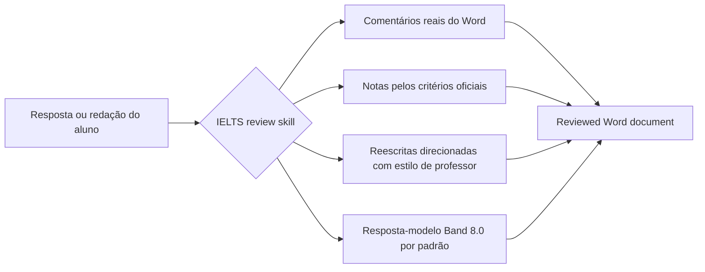

<div align="center">
  

  <h1>IELTS Writing Review Skills</h1>

  <p>
    Skills locais de correção para IELTS Academic Writing Task 1 / Task 2, desenvolvidas para Codex e Claude Code.
    Elas oferecem comentários reais em DOCX, critérios oficiais de avaliação, feedback com estilo de professor, reescritas direcionadas e geração de respostas-modelo.
  </p>

  <p>
    <a href="../README.md">简体中文</a>
    · <a href="./README.en.md">English</a>
    · <a href="./README.ja.md">日本語</a>
    · <a href="./README.ko.md">한국어</a>
    · <a href="./README.es.md">Español</a>
    · <a href="./README.vi.md">Tiếng Việt</a>
    · <a href="./README.hi.md">हिन्दी</a>
    · <a href="./README.ar.md">العربية</a>
    · <a href="./README.fr.md">Français</a>
    · <a href="./README.bn.md">বাংলা</a>
    · <a href="./README.pt.md"><strong>Português</strong></a>
    · <a href="./README.id.md">Bahasa Indonesia</a>
    · <a href="./README.ur.md">اردو</a>
    · <a href="./README.ru.md">Русский</a>
  </p>

  <p>
    <a href="https://github.com/AaronL725/ielts-writing-review-skills/stargazers"></a>
    <a href="../LICENSE"></a>
    
    
    
  </p>
</div>

## O que é este repositório?

Este repositório reúne duas skills de correção de IELTS Writing. Em vez de o AI agent fornecer apenas sugestões genéricas, ele pode executar um fluxo completo de revisão, semelhante ao trabalho de um professor de verdade: identificar a tarefa e o texto original do aluno, inserir comentários reais no Word, atribuir notas com base nos critérios oficiais, adicionar reescritas direcionadas de trechos específicos e gerar uma resposta-modelo correspondente de alta qualidade.

**Nível-alvo padrão: reescritas em itálico estáveis no Band 7.5 e resposta-modelo final estável no Band 8.0.** Se você não especificar outro target band, as duas skills calibram as reescritas locais em itálico para um Band 7.5 consistente e o `model answer` / `model essay` final para um Band 8.0 consistente. Você também pode escrever `Target band: 7.5`, `Target band: 8.0` ou outro objetivo no prompt para que o agent ajuste o foco do feedback de acordo com a sua meta.

| Skill | Cenários adequados | Saída padrão |
| --- | --- | --- |
| `$ielts-task1-review` | Gráficos, tabelas, mapas, diagramas de processo e visuais mistos do Academic Task 1 | DOCX reviewed com comentários do Word, notas, feedback, reescritas em itálico estáveis no Band 7.5 e resposta-modelo Band 8.0 em 4 parágrafos |
| `$ielts-task2-review` | Redações Task 2 de opinião, discussão, problema-solução, vantagens/desvantagens e tipos mistos | DOCX reviewed com comentários do Word, notas, feedback, reescritas em itálico estáveis no Band 7.5 e model essay Band 8.0 em 4 parágrafos |

## Requisitos do arquivo de entrada

Use como entrada **um arquivo `.docx` que ainda não tenha sido corrigido**. Arquivos reviewed servem apenas como prévia do resultado e não devem ser usados novamente como entrada para outra revisão.

| Tipo | Como organizar o documento do Word | O que evitar |
| --- | --- | --- |
| Task 1 | Coloque primeiro o texto da tarefa; depois, insira o gráfico/mapa/diagrama de processo como imagem incorporada no Word; coloque a resposta do aluno depois da imagem e separe-a em parágrafos normais | Não coloque a resposta antes da imagem; não omita o elemento visual; não misture notas antigas, respostas-modelo ou comentários anteriores no arquivo de entrada |
| Task 2 | Coloque a tarefa completa no início; se houver outline, coloque-o depois da tarefa e antes da redação formal; coloque a redação formal no final e separe-a em parágrafos normais | Não coloque a tarefa depois da redação; não trate o outline como a redação formal; não inclua feedback antigo, respostas-modelo ou conteúdo reviewed no arquivo de entrada |

Essa organização é importante porque a skill primeiro distingue a tarefa, as imagens, o outline e o texto principal do aluno; só depois ancora os comentários do Word nos parágrafos escritos pelo aluno.

## Arquivos de exemplo

O diretório `examples/` do repositório contém um conjunto de exemplos de Task 1 e Task 2. Arquivos sem `(reviewed)` são exemplos de entrada, enquanto arquivos com `(reviewed)` mostram a prévia do resultado após a correção.

| Exemplo | Arquivo |
| --- | --- |
| Entrada Task 1 | [C19T4 Writing Task 1.docx](<../examples/C19T4 Writing Task 1.docx>) |
| Saída reviewed Task 1 | [C19T4 Writing Task 1(reviewed).docx](<../examples/C19T4 Writing Task 1(reviewed).docx>) |
| Entrada Task 2 | [C19T4 Writing Task 2.docx](<../examples/C19T4 Writing Task 2.docx>) |
| Saída reviewed Task 2 | [C19T4 Writing Task 2(reviewed).docx](<../examples/C19T4 Writing Task 2(reviewed).docx>) |

## Principais destaques

| Experiência real de correção | Conhecimento IELTS integrado | Adequado para agents |
| --- | --- | --- |
| Insere comentários reais do Word, em vez de observações em texto simples entre parênteses | Usa os IELTS band descriptors oficiais para atribuir notas | Pode ser usado como local skill no Codex e no Claude Code |
| Ancora os comentários no texto original do aluno, não na tarefa nem no outline | Inclui regras com estilo de professor e referências extraídas de amostras | Inclui scripts de extração, geração e validação de DOCX |
| Insere uma italic rewrite curta depois do texto original | Task 1 exige examinar primeiro o visual; Task 2 exige examinar primeiro a task response | Preserva o arquivo original e cria uma reviewed copy separada |
| Gera página de notas, feedback curto e resposta-modelo | As reescritas em itálico ficam por padrão no Band 7.5; a resposta-modelo final, no Band 8.0 | Permite personalizar o target band pelo prompt |

## Fluxo de correção



## Instalação

### Prompt de instalação para agents de uso geral

```text
Install the IELTS Writing Review Skills from this GitHub repository: https://github.com/AaronL725/ielts-writing-review-skills and put the two skills into the correct local skills directory.
```

Também é possível instalar manualmente.

Primeiro, clone o repositório:

```bash
git clone https://github.com/AaronL725/ielts-writing-review-skills.git
cd ielts-writing-review-skills
```

### Codex

Instale as duas skills no diretório de skills do Codex:

```bash
mkdir -p "${CODEX_HOME:-$HOME/.codex}/skills"
cp -R skills/ielts-task1-review skills/ielts-task2-review "${CODEX_HOME:-$HOME/.codex}/skills/"
```

### Claude Code

Instale-as como personal skills do Claude Code:

```bash
mkdir -p "$HOME/.claude/skills"
cp -R skills/ielts-task1-review skills/ielts-task2-review "$HOME/.claude/skills/"
```

Se quiser usá-las apenas em um projeto específico, copie-as para `.claude/skills` no nível do projeto:

```bash
mkdir -p .claude/skills
cp -R skills/ielts-task1-review skills/ielts-task2-review .claude/skills/
```

## Exemplos de prompts

```text
Use $ielts-task1-review to review my IELTS Academic Writing Task 1 answer: [paste the path of your answer]
```

```text
Use $ielts-task2-review to review my IELTS Writing Task 2 essay: [paste the path of your essay]
```

```text
Use $ielts-task1-review to review my IELTS Academic Writing Task 1 answer. Target band: [your target band]. File: [paste the path of your answer]
```

```text
Use $ielts-task2-review to review my IELTS Writing Task 2 essay. Target band: [your target band]. File: [paste the path of your essay]
```

## O que cada Skill inclui?

A skill Task 1 inclui fluxo de análise visual, critérios oficiais de avaliação do Task 1, regras de correção com estilo de professor, referências de extração a partir de amostras, exemplos de gráficos, scripts de extração de DOCX, scripts de geração de DOCX e scripts de validação.

A skill Task 2 inclui extração da tarefa e da redação, critérios oficiais de avaliação do Task 2, regras de correção com estilo de professor, referências de extração a partir de amostras, lógica de correspondência com exemplos de professores, scripts de geração de DOCX e scripts de validação.

## Estrutura do repositório

```text
.
|-- assets/
|   `-- ielts-writing-review-skills-hero.png
|-- docs/
|   |-- README.ar.md
|   |-- README.bn.md
|   |-- README.en.md
|   |-- README.es.md
|   |-- README.fr.md
|   |-- README.hi.md
|   |-- README.id.md
|   |-- README.ja.md
|   |-- README.ko.md
|   |-- README.pt.md
|   |-- README.ru.md
|   |-- README.ur.md
|   `-- README.vi.md
|-- examples/
|   |-- C19T4 Writing Task 1.docx
|   |-- C19T4 Writing Task 1(reviewed).docx
|   |-- C19T4 Writing Task 2.docx
|   `-- C19T4 Writing Task 2(reviewed).docx
|-- skills/
|   |-- ielts-task1-review/
|   |   |-- SKILL.md
|   |   |-- agents/
|   |   |-- references/
|   |   `-- scripts/
|   `-- ielts-task2-review/
|       |-- SKILL.md
|       |-- agents/
|       |-- references/
|       `-- scripts/
|-- LICENSE
`-- README.md
```

## Compatibilidade

| Agent | Status | Descrição |
| --- | --- | --- |
| Codex | Ready | Copie as skills para `$CODEX_HOME/skills`, normalmente `~/.codex/skills` |
| Claude Code | Ready | Copie-as para `~/.claude/skills` ou para `.claude/skills` do projeto |
| Outros agents locais | Manual | Use o prompt de instalação geral e coloque as duas skills no diretório local de skills apropriado do agent |

## ⭐️ Dê uma Star a este repositório

Se este repositório economiza seu tempo na correção de IELTS Writing, dar uma star pode ajudar mais estudantes e professores a encontrá-lo.