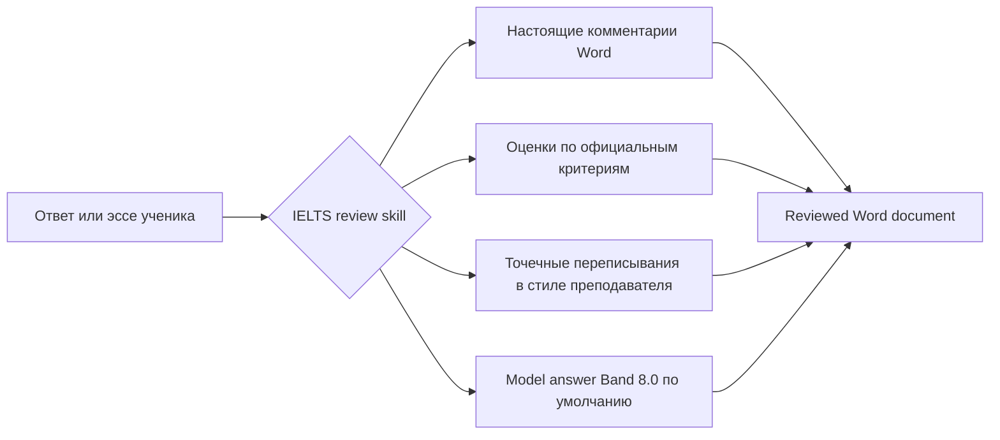

<div align="center">
  

  <h1>IELTS Writing Review Skills</h1>

  <p>
    Локальные skills для проверки IELTS Academic Writing Task 1 / Task 2, разработанные для Codex и Claude Code.
    Поддерживаются настоящие комментарии в DOCX, официальные критерии оценивания, обратная связь в стиле преподавателя, точечные переписывания и генерация образцовых ответов.
  </p>

  <p>
    <a href="../README.md">简体中文</a>
    · <a href="./README.en.md">English</a>
    · <a href="./README.ja.md">日本語</a>
    · <a href="./README.ko.md">한국어</a>
    · <a href="./README.es.md">Español</a>
    · <a href="./README.vi.md">Tiếng Việt</a>
    · <a href="./README.hi.md">हिन्दी</a>
    · <a href="./README.ar.md">العربية</a>
    · <a href="./README.fr.md">Français</a>
    · <a href="./README.bn.md">বাংলা</a>
    · <a href="./README.pt.md">Português</a>
    · <a href="./README.id.md">Bahasa Indonesia</a>
    · <a href="./README.ur.md">اردو</a>
    · <a href="./README.ru.md"><strong>Русский</strong></a>
  </p>

  <p>
    <a href="https://github.com/AaronL725/ielts-writing-review-skills/stargazers"></a>
    <a href="../LICENSE"></a>
    
    
    
  </p>
</div>

## Что это за репозиторий?

В этом репозитории упакованы две skills для проверки IELTS Writing. Они позволяют AI agent не ограничиваться общими советами, а выполнять полный цикл проверки, близкий к работе реального преподавателя: распознавать задание и исходный текст ученика, вставлять настоящие комментарии Word, выставлять оценки по официальным критериям, добавлять точечные улучшенные переписывания и генерировать соответствующий качественный образцовый ответ.

**Целевой уровень по умолчанию: стабильные italic rewrites на Band 7.5 и финальный model answer на стабильном Band 8.0.** Если вы не зададите другой target band, обе skills будут калибровать локальные italic rewrites на стабильный Band 7.5, а финальный `model answer` / `model essay` — на стабильный Band 8.0. В prompt также можно указать `Target band: 7.5`, `Target band: 8.0` или другой уровень, чтобы agent соответствующим образом изменил акценты feedback.

| Skill | Подходящие сценарии | Вывод по умолчанию |
| --- | --- | --- |
| `$ielts-task1-review` | Графики, таблицы, карты, схемы процессов и смешанные визуальные материалы Academic Task 1 | Reviewed DOCX с комментариями Word, оценками, feedback, стабильными italic rewrites Band 7.5 и образцовым ответом Band 8.0 из 4 абзацев |
| `$ielts-task2-review` | Эссе Task 2 типов opinion, discussion, problem-solution, advantages/disadvantages и смешанных типов | Reviewed DOCX с комментариями Word, оценками, feedback, стабильными italic rewrites Band 7.5 и образцовым model essay Band 8.0 из 4 абзацев |

## Требования к входному файлу

Используйте в качестве входного файла **непроверенный ранее `.docx`**. Reviewed-файлы предназначены только для просмотра результата и не должны повторно использоваться как вход для новой проверки.

| Тип | Как расположить содержимое в Word | Чего не следует делать |
| --- | --- | --- |
| Task 1 | Сначала поместите текст задания; затем вставьте график/карту/схему процесса как изображение, встроенное в Word; после изображения разместите ответ ученика, разделённый на обычные абзацы | Не помещайте ответ ученика перед изображением; не пропускайте визуальный материал; не добавляйте старые оценки, model answers или комментарии во входной файл |
| Task 2 | Сначала поместите полное задание; если есть outline, расположите его после задания и перед основным эссе; само эссе поместите в конце и разделите на обычные абзацы | Не помещайте задание после эссе; не считайте outline основным эссе; не включайте старый feedback, model answers или reviewed-контент во входной файл |

Такое расположение важно, потому что skill сначала различает задание, изображения, outline и основной текст ученика, а затем привязывает комментарии Word к абзацам именно ученического текста.

## Примеры файлов

В каталоге `examples/` находится набор примеров Task 1 и Task 2. Файлы без `(reviewed)` — это примеры входных данных, а файлы с `(reviewed)` показывают результат после проверки.

| Пример | Файл |
| --- | --- |
| Вход Task 1 | [C19T4 Writing Task 1.docx](<../examples/C19T4 Writing Task 1.docx>) |
| Reviewed-вывод Task 1 | [C19T4 Writing Task 1(reviewed).docx](<../examples/C19T4 Writing Task 1(reviewed).docx>) |
| Вход Task 2 | [C19T4 Writing Task 2.docx](<../examples/C19T4 Writing Task 2.docx>) |
| Reviewed-вывод Task 2 | [C19T4 Writing Task 2(reviewed).docx](<../examples/C19T4 Writing Task 2(reviewed).docx>) |

## Ключевые возможности

| Реалистичная проверка | Встроенные знания IELTS | Удобно для Agent |
| --- | --- | --- |
| Вставляет настоящие комментарии Word вместо текстовых замечаний в скобках | Оценивает по официальным IELTS band descriptors | Можно использовать как local skill в Codex и Claude Code |
| Привязывает комментарии к исходному тексту ученика, а не к заданию или outline | Включает правила в стиле преподавателя и справочные материалы, извлечённые из примеров | Включает scripts для извлечения, генерации и проверки DOCX |
| Добавляет краткий italic rewrite после исходного текста | Task 1 требует сначала проверить визуальный материал; Task 2 требует сначала проверить task response | Сохраняет исходный файл и создаёт отдельную reviewed copy |
| Создаёт страницу оценок, краткий feedback и model answer | По умолчанию italic rewrites — Band 7.5, финальный model answer — Band 8.0 | Target band можно задать в prompt |

## Процесс проверки



## Установка

### Общий prompt установки для agents

```text
Install the IELTS Writing Review Skills from this GitHub repository: https://github.com/AaronL725/ielts-writing-review-skills and put the two skills into the correct local skills directory.
```

Также можно установить вручную.

Сначала клонируйте репозиторий:

```bash
git clone https://github.com/AaronL725/ielts-writing-review-skills.git
cd ielts-writing-review-skills
```

### Codex

Установите обе skills в каталог skills Codex:

```bash
mkdir -p "${CODEX_HOME:-$HOME/.codex}/skills"
cp -R skills/ielts-task1-review skills/ielts-task2-review "${CODEX_HOME:-$HOME/.codex}/skills/"
```

### Claude Code

Установите их как personal skills Claude Code:

```bash
mkdir -p "$HOME/.claude/skills"
cp -R skills/ielts-task1-review skills/ielts-task2-review "$HOME/.claude/skills/"
```

Если они нужны только в конкретном проекте, скопируйте их в проектный каталог `.claude/skills`:

```bash
mkdir -p .claude/skills
cp -R skills/ielts-task1-review skills/ielts-task2-review .claude/skills/
```

## Примеры Prompt

```text
Use $ielts-task1-review to review my IELTS Academic Writing Task 1 answer: [paste the path of your answer]
```

```text
Use $ielts-task2-review to review my IELTS Writing Task 2 essay: [paste the path of your essay]
```

```text
Use $ielts-task1-review to review my IELTS Academic Writing Task 1 answer. Target band: [your target band]. File: [paste the path of your answer]
```

```text
Use $ielts-task2-review to review my IELTS Writing Task 2 essay. Target band: [your target band]. File: [paste the path of your essay]
```

## Что входит в каждую Skill?

Skill Task 1 включает процесс визуального анализа, официальные критерии оценивания Task 1, правила проверки в стиле преподавателя, справочные материалы, извлечённые из примеров, примеры графиков, scripts для извлечения DOCX, scripts для генерации DOCX и scripts для валидации.

Skill Task 2 включает извлечение задания и эссе, официальные критерии оценивания Task 2, правила проверки в стиле преподавателя, справочные материалы, извлечённые из примеров, логику сопоставления с примерами преподавателя, scripts для генерации DOCX и scripts для валидации.

## Структура репозитория

```text
.
|-- assets/
|   `-- ielts-writing-review-skills-hero.png
|-- docs/
|   |-- README.ar.md
|   |-- README.bn.md
|   |-- README.en.md
|   |-- README.es.md
|   |-- README.fr.md
|   |-- README.hi.md
|   |-- README.id.md
|   |-- README.ja.md
|   |-- README.ko.md
|   |-- README.pt.md
|   |-- README.ru.md
|   |-- README.ur.md
|   `-- README.vi.md
|-- examples/
|   |-- C19T4 Writing Task 1.docx
|   |-- C19T4 Writing Task 1(reviewed).docx
|   |-- C19T4 Writing Task 2.docx
|   `-- C19T4 Writing Task 2(reviewed).docx
|-- skills/
|   |-- ielts-task1-review/
|   |   |-- SKILL.md
|   |   |-- agents/
|   |   |-- references/
|   |   `-- scripts/
|   `-- ielts-task2-review/
|       |-- SKILL.md
|       |-- agents/
|       |-- references/
|       `-- scripts/
|-- LICENSE
`-- README.md
```

## Совместимость

| Agent | Статус | Описание |
| --- | --- | --- |
| Codex | Ready | Скопируйте в `$CODEX_HOME/skills`, обычно это `~/.codex/skills` |
| Claude Code | Ready | Скопируйте в `~/.claude/skills` или в проектный `.claude/skills` |
| Другие local agents | Manual | Используйте общий installation prompt и поместите обе skills в соответствующий локальный каталог skills данного agent |

## ⭐️ Поставьте Star этому репозиторию

Если этот репозиторий экономит ваше время при проверке IELTS Writing, star поможет большему числу учащихся и преподавателей найти его.