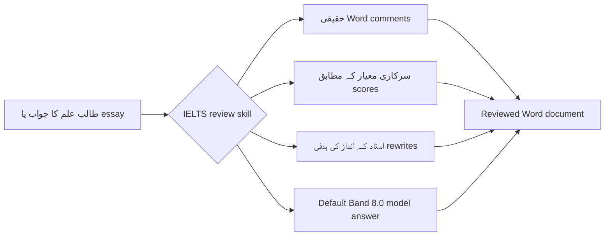

<div align="center">
  

  <h1>IELTS Writing Review Skills</h1>

  <p>
    Codex اور Claude Code کے لیے تیار کردہ IELTS Academic Writing Task 1 / Task 2 کی مقامی review skills۔
    یہ DOCX میں حقیقی comments، سرکاری scoring criteria، استاد کے انداز کی feedback، ہدفی rewrites اور model answers بنانے کی سہولت دیتی ہیں۔
  </p>

  <p>
    <a href="../README.md">简体中文</a>
    · <a href="./README.en.md">English</a>
    · <a href="./README.ja.md">日本語</a>
    · <a href="./README.ko.md">한국어</a>
    · <a href="./README.es.md">Español</a>
    · <a href="./README.vi.md">Tiếng Việt</a>
    · <a href="./README.hi.md">हिन्दी</a>
    · <a href="./README.ar.md">العربية</a>
    · <a href="./README.fr.md">Français</a>
    · <a href="./README.bn.md">বাংলা</a>
    · <a href="./README.pt.md">Português</a>
    · <a href="./README.id.md">Bahasa Indonesia</a>
    · <a href="./README.ur.md"><strong>اردو</strong></a>
    · <a href="./README.ru.md">Русский</a>
  </p>

  <p>
    <a href="https://github.com/AaronL725/ielts-writing-review-skills/stargazers"></a>
    <a href="../LICENSE"></a>
    
    
    
  </p>
</div>

## یہ repository کیا ہے؟

یہ repository IELTS Writing کی review کے لیے دو skills کو ایک جگہ فراہم کرتی ہے۔ مقصد یہ ہے کہ AI agent صرف عمومی مشورے نہ دے، بلکہ ایک حقیقی استاد کے قریب مکمل review workflow انجام دے: سوال اور طالب علم کی اصل تحریر کی شناخت کرے، Word میں حقیقی comments شامل کرے، سرکاری معیار کے مطابق scores دے، مخصوص حصوں میں بہتر اور ہدفی rewrites شامل کرے، اور متعلقہ اعلیٰ معیار کا model answer تیار کرے۔

**Default target level: italic rewrites مستقل Band 7.5 اور آخری model answer مستقل Band 8.0۔** اگر آپ کوئی مختلف target band متعین نہیں کرتے تو دونوں skills مقامی italic rewrites کو مستحکم Band 7.5 اور آخری `model answer` / `model essay` کو مستحکم Band 8.0 کے مطابق calibrate کرتی ہیں۔ آپ prompt میں `Target band: 7.5`، `Target band: 8.0` یا کوئی اور ہدف بھی لکھ سکتے ہیں تاکہ agent feedback کا فوکس اسی حساب سے ایڈجسٹ کرے۔

| Skill | موزوں استعمال | Default output |
| --- | --- | --- |
| `$ielts-task1-review` | Academic Task 1 کے charts، tables، maps، process diagrams اور mixed visuals | Word comments، scores، feedback، مستحکم Band 7.5 italic rewrites اور 4 پیراگراف کا Band 8.0 model answer والا reviewed DOCX |
| `$ielts-task2-review` | Task 2 کے opinion، discussion، problem-solution، advantages/disadvantages اور mixed essay types | Word comments، scores، feedback، مستحکم Band 7.5 italic rewrites اور 4 پیراگراف کا Band 8.0 model essay والا reviewed DOCX |

## Input file کی ضروریات

Input کے طور پر **ایسی `.docx` فائل استعمال کریں جس کی پہلے review نہ ہوئی ہو**۔ Reviewed فائلیں صرف نتیجہ preview کرنے کے لیے ہیں؛ انہیں دوبارہ نئی review کے input کے طور پر استعمال نہ کریں۔

| قسم | Word document میں ترتیب | کن چیزوں سے بچیں |
| --- | --- | --- |
| Task 1 | سوال کا متن سب سے پہلے رکھیں؛ chart/map/process diagram کو سوال کے بعد Word میں embedded image کے طور پر رکھیں؛ طالب علم کا جواب image کے بعد عام paragraphs میں رکھیں | طالب علم کا جواب image سے پہلے نہ رکھیں؛ visual غائب نہ کریں؛ پرانے scores، model answers یا comments input file میں شامل نہ کریں |
| Task 2 | مکمل سوال سب سے پہلے رکھیں؛ اگر outline ہو تو اسے سوال کے بعد اور باقاعدہ essay سے پہلے رکھیں؛ باقاعدہ essay آخر میں عام paragraphs میں رکھیں | سوال essay کے بعد نہ رکھیں؛ outline کو باقاعدہ essay نہ سمجھیں؛ پرانی feedback، model answers یا reviewed content input file میں شامل نہ کریں |

ان حصوں کی جگہ اہم ہے، کیونکہ skill پہلے سوال، images، outline اور طالب علم کے اصل متن کو الگ پہچانتی ہے، پھر Word comments کو طالب علم کے متن والے paragraphs سے anchor کرتی ہے۔

## Example files

Repository کے `examples/` فولڈر میں Task 1 اور Task 2 کے examples کا ایک سیٹ موجود ہے۔ جن فائلوں میں `(reviewed)` نہیں ہے وہ input examples ہیں، جبکہ `(reviewed)` والی فائلیں review کے بعد کے output previews ہیں۔

| Example | File |
| --- | --- |
| Task 1 input | [C19T4 Writing Task 1.docx](<../examples/C19T4 Writing Task 1.docx>) |
| Task 1 reviewed output | [C19T4 Writing Task 1(reviewed).docx](<../examples/C19T4 Writing Task 1(reviewed).docx>) |
| Task 2 input | [C19T4 Writing Task 2.docx](<../examples/C19T4 Writing Task 2.docx>) |
| Task 2 reviewed output | [C19T4 Writing Task 2(reviewed).docx](<../examples/C19T4 Writing Task 2(reviewed).docx>) |

## اہم خصوصیات

| حقیقی review کا تجربہ | Built-in IELTS knowledge | Agent-friendly |
| --- | --- | --- |
| سادہ متن میں قوسین والی notes کے بجائے حقیقی Word comments شامل کرتی ہے | سرکاری IELTS band descriptors کے مطابق scoring کرتی ہے | Codex اور Claude Code میں local skill کے طور پر استعمال ہو سکتی ہے |
| Comments کو سوال یا outline کے بجائے طالب علم کی اصل تحریر سے anchor کرتی ہے | استاد کے انداز کے rules اور samples سے اخذ کردہ references شامل ہیں | DOCX extraction، generation اور validation scripts شامل ہیں |
| اصل متن کے بعد مختصر italic rewrite شامل کرتی ہے | Task 1 میں پہلے visual دیکھنا لازمی ہے؛ Task 2 میں پہلے task response دیکھنا لازمی ہے | اصل فائل محفوظ رکھتی ہے اور الگ reviewed copy بناتی ہے |
| Score page، مختصر feedback اور model answer تیار کرتی ہے | Italic rewrites default Band 7.5 اور آخری model answer Band 8.0 | Prompt کے ذریعے target band اپنی مرضی سے مقرر کیا جا سکتا ہے |

## Review workflow



## Installation

### عام agents کے لیے installation prompt

```text
Install the IELTS Writing Review Skills from this GitHub repository: https://github.com/AaronL725/ielts-writing-review-skills and put the two skills into the correct local skills directory.
```

آپ دستی طور پر بھی install کر سکتے ہیں۔

پہلے repository clone کریں:

```bash
git clone https://github.com/AaronL725/ielts-writing-review-skills.git
cd ielts-writing-review-skills
```

### Codex

دونوں skills کو Codex skills directory میں install کریں:

```bash
mkdir -p "${CODEX_HOME:-$HOME/.codex}/skills"
cp -R skills/ielts-task1-review skills/ielts-task2-review "${CODEX_HOME:-$HOME/.codex}/skills/"
```

### Claude Code

انہیں Claude Code personal skills کے طور پر install کریں:

```bash
mkdir -p "$HOME/.claude/skills"
cp -R skills/ielts-task1-review skills/ielts-task2-review "$HOME/.claude/skills/"
```

اگر صرف کسی مخصوص project میں استعمال کرنا ہو تو انہیں project-level `.claude/skills` میں copy کریں:

```bash
mkdir -p .claude/skills
cp -R skills/ielts-task1-review skills/ielts-task2-review .claude/skills/
```

## Prompt examples

```text
Use $ielts-task1-review to review my IELTS Academic Writing Task 1 answer: [paste the path of your answer]
```

```text
Use $ielts-task2-review to review my IELTS Writing Task 2 essay: [paste the path of your essay]
```

```text
Use $ielts-task1-review to review my IELTS Academic Writing Task 1 answer. Target band: [your target band]. File: [paste the path of your answer]
```

```text
Use $ielts-task2-review to review my IELTS Writing Task 2 essay. Target band: [your target band]. File: [paste the path of your essay]
```

## ہر Skill میں کیا شامل ہے؟

Task 1 skill میں visual-analysis workflow، Task 1 کے سرکاری scoring criteria، teacher-style review rules، sample-extraction references، chart samples، DOCX extraction scripts، DOCX generation scripts اور validation scripts شامل ہیں۔

Task 2 skill میں task اور essay extraction، Task 2 کے سرکاری scoring criteria، teacher-style review rules، sample-extraction references، teacher-sample matching logic، DOCX generation scripts اور validation scripts شامل ہیں۔

## Repository structure

```text
.
|-- assets/
|   `-- ielts-writing-review-skills-hero.png
|-- docs/
|   |-- README.ar.md
|   |-- README.bn.md
|   |-- README.en.md
|   |-- README.es.md
|   |-- README.fr.md
|   |-- README.hi.md
|   |-- README.id.md
|   |-- README.ja.md
|   |-- README.ko.md
|   |-- README.pt.md
|   |-- README.ru.md
|   |-- README.ur.md
|   `-- README.vi.md
|-- examples/
|   |-- C19T4 Writing Task 1.docx
|   |-- C19T4 Writing Task 1(reviewed).docx
|   |-- C19T4 Writing Task 2.docx
|   `-- C19T4 Writing Task 2(reviewed).docx
|-- skills/
|   |-- ielts-task1-review/
|   |   |-- SKILL.md
|   |   |-- agents/
|   |   |-- references/
|   |   `-- scripts/
|   `-- ielts-task2-review/
|       |-- SKILL.md
|       |-- agents/
|       |-- references/
|       `-- scripts/
|-- LICENSE
`-- README.md
```

## Compatibility

| Agent | Status | وضاحت |
| --- | --- | --- |
| Codex | Ready | `$CODEX_HOME/skills` میں copy کریں، عام طور پر `~/.codex/skills` |
| Claude Code | Ready | `~/.claude/skills` یا project کی `.claude/skills` میں copy کریں |
| دیگر local agents | Manual | عام installation prompt استعمال کریں اور دونوں skills کو متعلقہ agent کی local skills directory میں رکھیں |

## ⭐️ اس repository کو Star دیں

اگر یہ repository IELTS Writing review میں آپ کا وقت بچاتی ہے، تو ایک star مزید learners اور teachers کو اسے تلاش کرنے میں مدد دے سکتا ہے۔