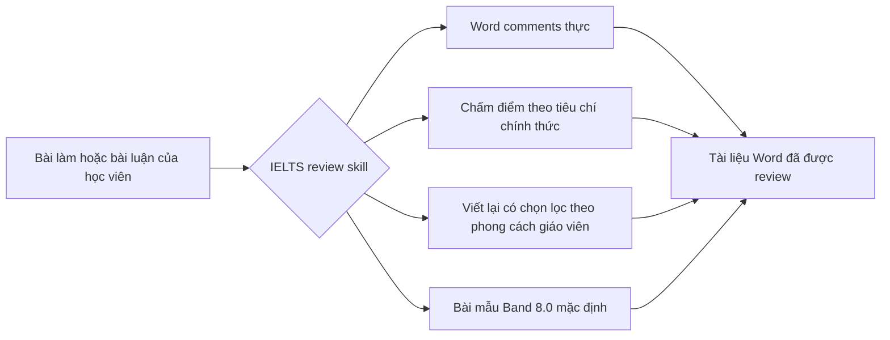

<div align="center">
  

  <h1>IELTS Writing Review Skills</h1>

  <p>
    Bộ kỹ năng chấm và nhận xét IELTS Academic Writing Task 1 / Task 2 chạy cục bộ dành cho Codex và Claude Code.
    Hỗ trợ comment thực trong DOCX, tiêu chí chấm điểm chính thức, nhận xét theo phong cách giáo viên, viết lại có chọn lọc và tạo bài mẫu.
  </p>

  <p>
    <a href="../README.md">简体中文</a>
    · <a href="./README.en.md">English</a>
    · <a href="./README.ja.md">日本語</a>
    · <a href="./README.ko.md">한국어</a>
    · <a href="./README.es.md">Español</a>
    · <a href="./README.vi.md"><strong>Tiếng Việt</strong></a>
  </p>

  <p>
    <a href="https://github.com/AaronL725/ielts-writing-review-skills/stargazers"></a>
    <a href="../LICENSE"></a>
    
    
    
  </p>
</div>

## Kho lưu trữ này là gì?

Kho lưu trữ này đóng gói hai skill chấm và nhận xét IELTS Writing, giúp AI agent không chỉ đưa ra những góp ý chung chung mà có thể thực hiện một quy trình chấm bài hoàn chỉnh theo cách gần với giáo viên thực tế: nhận diện đề bài và bài viết gốc của học viên, chèn comment thực trong Word, chấm theo các tiêu chí chính thức, thêm các đoạn viết lại được tinh chỉnh có chọn lọc và tạo bài mẫu chất lượng cao tương ứng.

**Mức mục tiêu mặc định: các đoạn viết lại in nghiêng ổn định ở Band 7.5, còn bài mẫu cuối cùng ổn định ở Band 8.0.** Nếu bạn không chỉ định thêm band mục tiêu, cả hai skill sẽ mặc định hiệu chỉnh các đoạn italic rewrite cục bộ ở mức Band 7.5 ổn định và model answer / model essay cuối cùng ở mức Band 8.0 ổn định. Bạn cũng có thể ghi `Target band: 7.5`, `Target band: 8.0`, v.v. trong prompt để agent điều chỉnh trọng tâm phản hồi theo band mục tiêu của bạn.

| Skill | Trường hợp phù hợp | Đầu ra mặc định |
| --- | --- | --- |
| `$ielts-task1-review` | Academic Task 1: biểu đồ, bảng, bản đồ, sơ đồ quy trình và dạng hình kết hợp | DOCX đã được review kèm Word comments, điểm số, phản hồi, các đoạn viết lại in nghiêng Band 7.5 ổn định và bài mẫu Band 8.0 gồm 4 đoạn |
| `$ielts-task2-review` | Task 2: bài nêu quan điểm, thảo luận, vấn đề–giải pháp, lợi ích–bất lợi và dạng bài kết hợp | DOCX đã được review kèm Word comments, điểm số, phản hồi, các đoạn viết lại in nghiêng Band 7.5 ổn định và bài mẫu Band 8.0 gồm 4 đoạn |

## Yêu cầu đối với tệp đầu vào

Hãy sử dụng **tệp `.docx` chưa được chấm/review** làm đầu vào. Các tệp đã được reviewed chỉ nên dùng để xem trước kết quả, không nên tiếp tục dùng chính tệp reviewed đó để chấm lại.

| Loại | Cách sắp xếp trong tài liệu Word | Không nên làm như sau |
| --- | --- | --- |
| Task 1 | Đặt phần chữ của đề bài ở đầu; đặt biểu đồ/bản đồ/sơ đồ quy trình dưới dạng ảnh được nhúng trong Word ngay sau đề; đặt bài làm của học viên sau ảnh và chia thành các đoạn văn bình thường | Không đặt bài làm của học viên trước ảnh; không bỏ thiếu hình minh họa; không trộn điểm số, bài mẫu hoặc comment cũ vào tệp đầu vào |
| Task 2 | Đặt đầy đủ đề bài ở đầu; nếu có outline, có thể đặt sau đề và trước bài viết chính thức; đặt bài viết chính thức ở cuối và chia thành các đoạn văn bình thường | Không đặt đề bài sau bài viết; không coi outline là bài viết chính thức; không đưa phản hồi cũ, bài mẫu hoặc nội dung reviewed vào tệp đầu vào |

Vị trí của các phần này rất quan trọng, vì skill trước tiên sẽ phân biệt đề bài, hình ảnh, outline và phần bài viết chính của học viên, sau đó mới neo Word comments vào các đoạn thuộc bài viết của học viên.

## Tệp ví dụ

Thư mục `examples/` trong kho lưu trữ chứa một bộ ví dụ Task 1 và Task 2. Các tệp không có `(reviewed)` là ví dụ đầu vào, còn các tệp có `(reviewed)` là bản xem trước kết quả sau khi chấm.

| Ví dụ | Tệp |
| --- | --- |
| Đầu vào Task 1 | [C19T4 Writing Task 1.docx](<../examples/C19T4 Writing Task 1.docx>) |
| Đầu ra reviewed Task 1 | [C19T4 Writing Task 1(reviewed).docx](<../examples/C19T4 Writing Task 1(reviewed).docx>) |
| Đầu vào Task 2 | [C19T4 Writing Task 2.docx](<../examples/C19T4 Writing Task 2.docx>) |
| Đầu ra reviewed Task 2 | [C19T4 Writing Task 2(reviewed).docx](<../examples/C19T4 Writing Task 2(reviewed).docx>) |

## Điểm nổi bật chính

| Trải nghiệm chấm bài thực tế | Kiến thức IELTS tích hợp sẵn | Thân thiện với Agent |
| --- | --- | --- |
| Chèn Word comments thực, không phải ghi chú thuần văn bản trong ngoặc | Chấm điểm theo official IELTS band descriptors | Có thể dùng như local skill cho Codex và Claude Code |
| Comment được neo vào bài viết gốc của học viên, không chấm nhầm vào đề bài hoặc outline | Tích hợp quy tắc theo phong cách giáo viên và tài liệu tham chiếu được rút ra từ mẫu | Bao gồm script trích xuất, tạo và xác minh DOCX |
| Chèn một đoạn italic rewrite ngắn gọn sau phần văn bản gốc | Task 1 bắt buộc ưu tiên xem hình trước; Task 2 bắt buộc ưu tiên đánh giá task response | Giữ nguyên tệp gốc và xuất một reviewed copy riêng biệt |
| Xuất trang điểm số, phản hồi ngắn và bài mẫu | Mặc định các đoạn viết lại in nghiêng ở Band 7.5, bài mẫu cuối ở Band 8.0 | Có thể tùy chỉnh band mục tiêu thông qua prompt |

## Quy trình chấm và nhận xét



## Cài đặt

### Prompt cài đặt chung cho agent

```text
Install the IELTS Writing Review Skills from this GitHub repository: https://github.com/AaronL725/ielts-writing-review-skills and put the two skills into the correct local skills directory.
```

Bạn cũng có thể cài đặt thủ công:

Trước tiên, clone kho lưu trữ:

```bash
git clone https://github.com/AaronL725/ielts-writing-review-skills.git
cd ielts-writing-review-skills
```

### Codex

Cài đặt cả hai skill vào thư mục skills của Codex:

```bash
mkdir -p "${CODEX_HOME:-$HOME/.codex}/skills"
cp -R skills/ielts-task1-review skills/ielts-task2-review "${CODEX_HOME:-$HOME/.codex}/skills/"
```

### Claude Code

Cài đặt dưới dạng personal skills của Claude Code:

```bash
mkdir -p "$HOME/.claude/skills"
cp -R skills/ielts-task1-review skills/ielts-task2-review "$HOME/.claude/skills/"
```

Nếu chỉ muốn sử dụng trong một dự án cụ thể, bạn có thể sao chép chúng vào `.claude/skills` ở cấp dự án:

```bash
mkdir -p .claude/skills
cp -R skills/ielts-task1-review skills/ielts-task2-review .claude/skills/
```

## Ví dụ Prompt

```text
Use $ielts-task1-review to review my IELTS Academic Writing Task 1 answer: [paste the path of your answer]
```

```text
Use $ielts-task2-review to review my IELTS Writing Task 2 essay: [paste the path of your essay]
```

```text
Use $ielts-task1-review to review my IELTS Academic Writing Task 1 answer. Target band: [your target band]. File: [paste the path of your answer]
```

```text
Use $ielts-task2-review to review my IELTS Writing Task 2 essay. Target band: [your target band]. File: [paste the path of your essay]
```

## Mỗi Skill bao gồm những gì?

Skill Task 1 bao gồm quy trình phân tích hình ảnh, tiêu chí chấm điểm chính thức của Task 1, quy tắc chấm bài theo phong cách giáo viên, tài liệu tham chiếu được rút ra từ mẫu, mẫu biểu đồ, script trích xuất DOCX, script tạo DOCX và script xác minh.

Skill Task 2 bao gồm trích xuất đề bài và bài viết, tiêu chí chấm điểm chính thức của Task 2, quy tắc chấm bài theo phong cách giáo viên, tài liệu tham chiếu được rút ra từ mẫu, logic đối chiếu mẫu của giáo viên, script tạo DOCX và script xác minh.

## Cấu trúc kho lưu trữ

```text
.
|-- assets/
|   `-- ielts-writing-review-skills-hero.png
|-- docs/
|   |-- README.en.md
|   |-- README.es.md
|   |-- README.ja.md
|   |-- README.ko.md
|   `-- README.vi.md
|-- examples/
|   |-- C19T4 Writing Task 1.docx
|   |-- C19T4 Writing Task 1(reviewed).docx
|   |-- C19T4 Writing Task 2.docx
|   `-- C19T4 Writing Task 2(reviewed).docx
|-- skills/
|   |-- ielts-task1-review/
|   |   |-- SKILL.md
|   |   |-- agents/
|   |   |-- references/
|   |   `-- scripts/
|   `-- ielts-task2-review/
|       |-- SKILL.md
|       |-- agents/
|       |-- references/
|       `-- scripts/
|-- LICENSE
`-- README.md
```

## Khả năng tương thích

| Agent | Trạng thái | Mô tả |
| --- | --- | --- |
| Codex | Ready | Sao chép vào `$CODEX_HOME/skills`, thông thường là `~/.codex/skills` |
| Claude Code | Ready | Sao chép vào `~/.claude/skills` hoặc `.claude/skills` của dự án |
| Các local agent khác | Manual | Sử dụng prompt cài đặt chung và đặt cả hai skill vào thư mục local skills tương ứng của agent |

## ⭐️ Hãy Star kho lưu trữ này

Nếu kho lưu trữ này giúp bạn tiết kiệm thời gian khi chấm IELTS Writing, một lượt star có thể giúp nhiều người học và giáo viên hơn tìm thấy nó.
